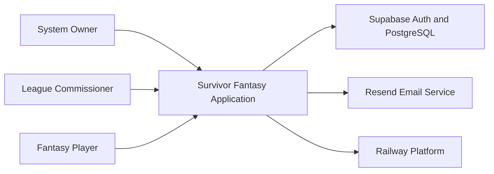
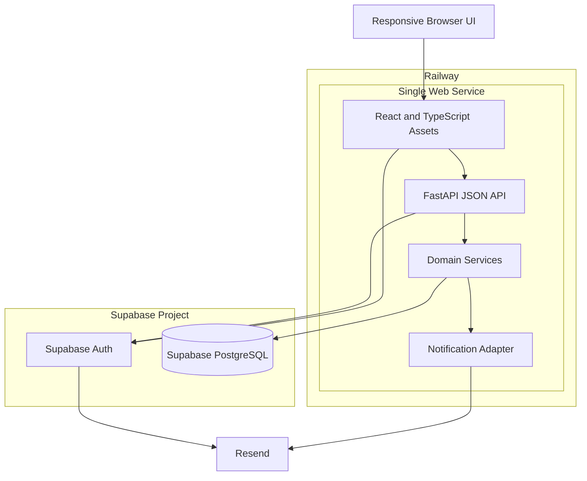
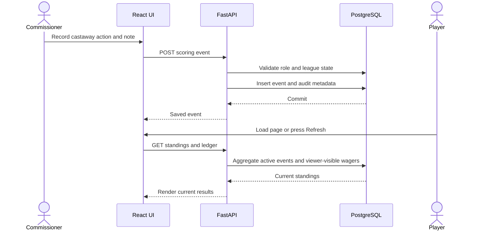
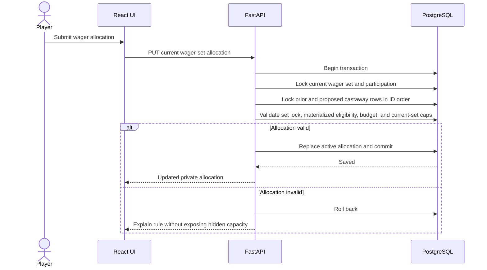
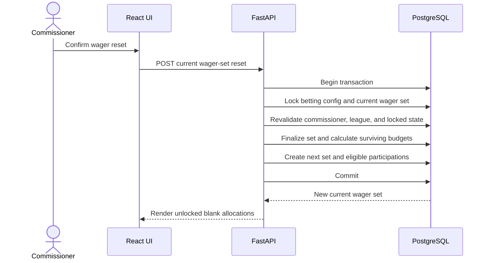
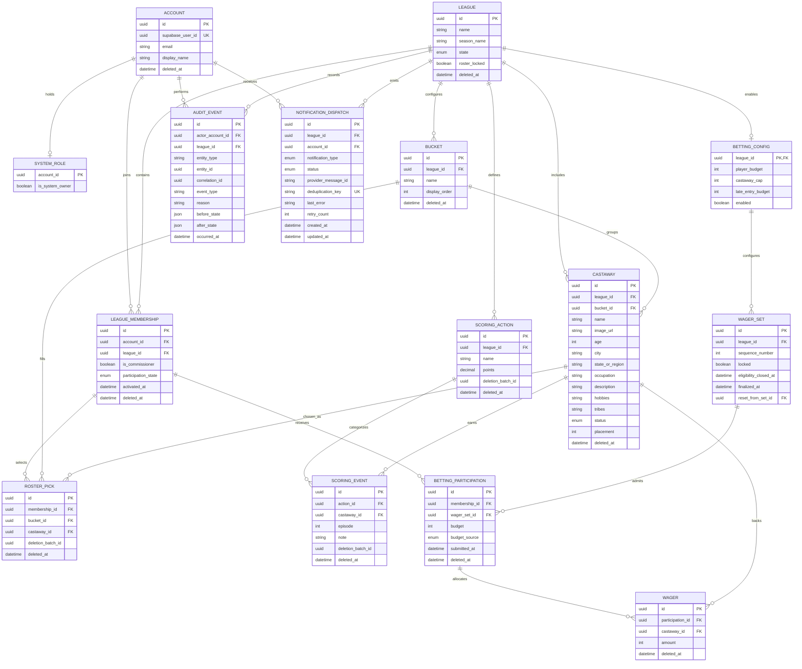
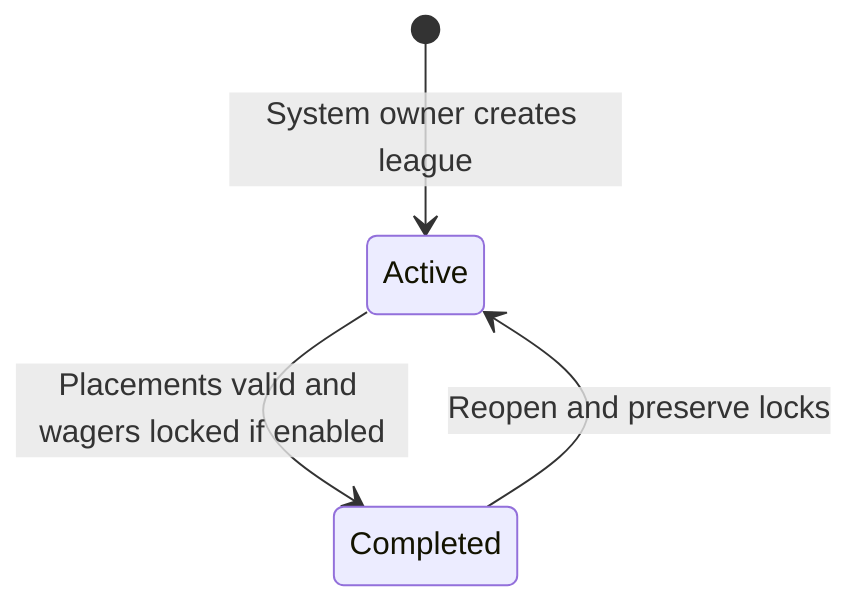
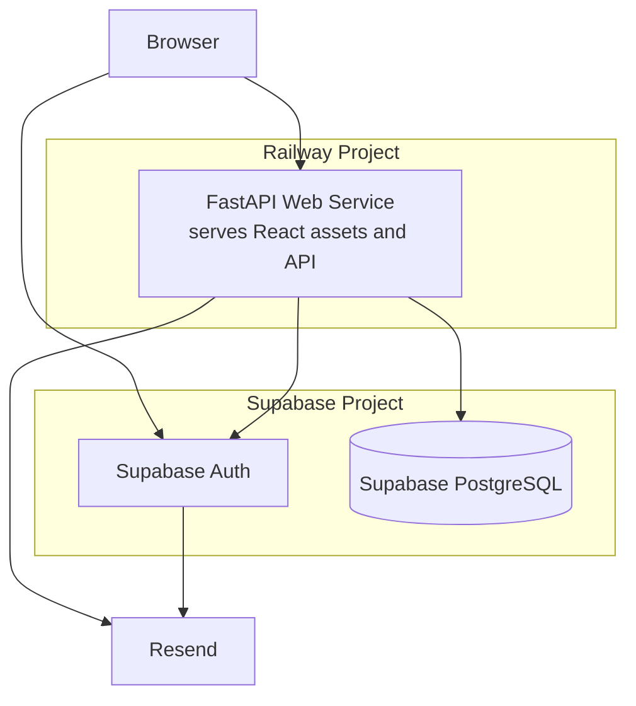

# Survivor Fantasy Application

## Document Information

- Status: Complete
- Last updated: 2026-09-13
- Workflow phase: Complete
- Canonical format: Markdown with Mermaid diagrams

## Executive Summary

This document proposes a fresh implementation of a private, invitation-only fantasy game for *Survivor*. A league belongs to one television season. League members select one castaway from each commissioner-defined bucket, earn points when commissioners record scoring events for their selected castaways, and optionally participate in a virtual-currency winner-prediction game.

The initial release targets one active league of up to 50 members, while preserving explicit league boundaries so the same accounts can join future leagues without a schema rewrite. The selected architecture is a modular monolith: a React and TypeScript frontend and FastAPI backend deployed as one Railway web service, with Supabase providing managed PostgreSQL and invite-only authentication. Resend provides Supabase's custom SMTP delivery and the one application notification needed when an existing account is added to another league.

Scores and standings are calculated from authoritative scoring events and wager records. PostgreSQL transactions protect the league-wide wager caps. WebSockets, background workers, caches, microservices, object storage, and real-money payment infrastructure are intentionally excluded.

## Context

The project is a fresh rewrite. The previous application is explicitly out of scope as a design or implementation reference unless the project owner later authorizes its use.

One person will build and maintain the application. That person has professional experience with React, TypeScript, and Python web development. The application will run on an existing Railway Hobby account with a target operating cost of no more than approximately USD 10 per month. Occasional downtime is acceptable.

The application handles only virtual points and currency. It has no entry fee, purchased currency, cash value, or real-world payout.

## Objective

Provide a reliable and auditable way for a private group to run a configurable *Survivor* fantasy league without maintaining scores, rosters, standings, and winner predictions manually.

## Goals

- Let a system owner create a league for a single *Survivor* season.
- Let league commissioners manually configure castaways, buckets, scoring actions, and an optional betting module.
- Let invited users create accounts and participate in multiple leagues over time.
- Let each player select exactly one castaway from every bucket, with non-exclusive selections across players.
- Update scores and standings immediately when a commissioner creates, edits, restores, or soft-deletes a scoring event or changes an action's point value.
- Provide a player-visible scoring ledger and private commissioner audit history.
- Enforce roster and betting visibility and lock rules.
- Enforce league-wide castaway wager caps under concurrent submissions.
- Preserve completed leagues as read-only history while allowing commissioners to reopen them for corrections.
- Support up to 50 members per league in the initial release without introducing a schema-level membership cap.

## Non-Goals

- Importing castaway or season data from spreadsheets or external services.
- Using the previous application as a reference.
- Supporting real-money wagering, prizes, payments, or purchased virtual currency.
- Native mobile applications or an installable PWA.
- Real-time push updates, WebSockets, or live multi-user synchronization.
- Copying configuration from a previous league in the first release.
- Automatic ingestion of episode events or elimination results.
- High-availability deployment within the initial budget.
- Supporting more than 50 members per league as a verified capacity target in the first release.
- Storing castaway images in application-managed object storage.
- Tracking castaway tribe membership as historical, episode-scoped data; `tribes` is display-only text in the first release.
- Supporting castaway-specific betting caps; one commissioner-configured cap applies uniformly to every eligible castaway in a league.

## Key Scenarios

### Bootstrap the system owner

- Actor: Project operator
- Trigger: Initial deployment or recovery in a new environment
- Behavior: Run an idempotent script with configurable account and initial-league parameters.
- Result: The original account is linked to the external identity provider, receives the global system-owner role, and is assigned as commissioner of the initial league.
- Failure behavior: Re-running the same command must not create duplicate identities, leagues, memberships, or roles.

### Configure a league

- Actor: System owner and league commissioner
- Trigger: A new season begins
- Behavior: The system owner creates a league, which is active immediately. Commissioners add castaways, place every castaway in exactly one bucket, define scoring actions, invite members, and optionally enable betting within the active league. Enabling betting creates the initial current wager set and assigns the configured initial budget to every currently eligible player.
- Result: The league exists for the season without a separate start action; commissioners independently control roster and betting locks as setup progresses.
- Important failure case: A league must not open roster selection while a castaway is unbucketed.

### Select a roster

- Actor: Player, or commissioner acting for a player
- Trigger: A player edits while roster selection is unlocked, or a commissioner edits on the player's behalf regardless of lock state.
- Behavior: Select one castaway from each bucket. Other players may select the same castaway. A commissioner may fill or replace selections on a player's behalf, and the application audits that action.
- Result: A complete roster is saved.
- Failure behavior: Reject incomplete rosters, duplicate selections within the same bucket, selections from the wrong league, or player self-service writes while locked. The lock does not reject a commissioner override.

### Lock roster selection

- Actor: Commissioner
- Trigger: Commissioner attempts to lock an open roster-selection period.
- Behavior: Validate that every active player membership has exactly one active castaway selection in every active bucket.
- Result: If all rosters are complete, lock selection and reveal player rosters according to league visibility rules.
- Failure behavior: Refuse to lock, identify incomplete players and buckets, and allow the commissioner to complete those selections on each player's behalf.

### Add a player after the season starts

- Actor: Commissioner
- Trigger: A new or existing account joins an active league after normal roster selection has locked.
- Behavior: Create the membership in a pending-roster state and manually enter one castaway choice for every active bucket on the player's behalf. Existing players' rosters remain locked.
- Result: The new player cannot view scores or standings until the commissioner saves a complete, valid roster. Completing the roster activates score access, and the selected castaways contribute every active scoring event from the entire season, including events recorded before the membership was activated. If the current wager set's eligibility already closed on its first lock, the player is excluded from that set but may receive the league's configured late-entry budget after the next commissioner-initiated wager reset.
- Failure behavior: Reject activation if any bucket is missing, any selection belongs to another bucket or league, or the membership is inactive.

### Change bucket membership after selections exist

- Actor: Commissioner
- Trigger: Move a castaway between buckets or otherwise change affected bucket structure
- Behavior: Show a confirmation that identifies the destructive effect. On confirmation, clear every player's selections in all affected buckets and unlock roster selection for the league.
- Result: Players must repick the affected roster slots. Until then, they remain ranked using their current score, each missing bucket contributes zero, and the leaderboard marks their roster as incomplete.
- Failure behavior: The bucket mutation and roster clearing occur in one transaction.

### Soft-delete and restore a castaway

- Actor: Commissioner
- Trigger: A castaway record must be removed from active league configuration or restored
- Behavior: Before deletion, show the castaway's bucket and the affected players. On confirmation, soft-delete the castaway and every active roster pick referencing that castaway in one transaction, then unlock roster selection. Preserve the castaway's existing scoring events as player-visible ledger history, but reject new scoring events for the castaway while deleted. Restoring the castaway makes the castaway available again in their original bucket but does not automatically restore cleared roster picks.
- Result: Every affected active player remains on the leaderboard with that bucket missing, worth zero, and marked incomplete until they select a replacement from the same bucket. Existing wagers on the deleted castaway remain recorded but are treated as lost, just like wagers on an eliminated castaway, and no new wager may target the deleted castaway. A restored castaway may be selected again, its preserved events become score-eligible again under the normal retroactive-scoring rule, but existing replacement picks are never overwritten and previously lost wagers are not revived.
- Failure behavior: Roll back the castaway deletion, dependent roster-pick deletions, roster unlock, and wager-eligibility update together if any part fails. Existing scoring events are not part of the deletion transaction.

### Record a scoring event

- Actor: Commissioner
- Trigger: A castaway performs a configured action
- Behavior: Create one event for one occurrence with a castaway, action, episode number, and optional note. Roster-selection and wagering lock states do not restrict scoring entry while the league is active.
- Result: The event appears immediately in the player scoring ledger and affects standings on the next page load or manual refresh.
- Failure behavior: Reject events for another league, soft-deleted records, or a completed league. Elimination status alone does not block entry because commissioners may record an earlier episode late.

### Correct scoring

- Actor: Commissioner
- Trigger: A point value or recorded event is wrong
- Behavior: Edit the action definition or event, or soft-delete/restore the event.
- Result: Every historical event referencing the action uses the action's current point value, and standings recalculate accordingly.
- Failure behavior: Retain actor and timestamp history sufficient to audit the change.

### Delete and restore a scoring action

- Actor: Commissioner
- Trigger: A scoring action definition is no longer valid or must be restored.
- Behavior: Soft-delete or restore the action and its associated scoring events in one transaction.
- Result: Deleting the action removes all of its active events from ledgers and standings. Restoring it revives the events deleted by that same cascade, immediately restoring their score impact.
- Failure behavior: Do not restore an event that had already been deleted individually before the action cascade; identify cascade membership with a deletion-operation identifier and audit both operations.

### Place and reallocate wagers

- Actor: Player
- Trigger: Commissioner unlocks the current wager set
- Behavior: An eligible player submits their entire whole-number budget across active, non-eliminated castaways, subject to each castaway's league-wide cap. Every subsequent change replaces the complete allocation atomically; partial drafts are never stored.
- Result: Only a complete, valid allocation is saved. While wagering is unlocked, a player can see their own allocation and projected betting contribution, but no other player can see either value. Commissioner status does not bypass this restriction. Commissioners may see submission and validation status without seeing castaway choices or wager amounts. Exact used and remaining league-wide capacity per castaway is also hidden until lock. Wagers and betting-derived leaderboard contributions become visible to league players when wagering locks. Finalized wager sets remain available as read-only history after a reset.
- Failure behavior: Reject any submission that does not allocate exactly the full budget, as well as overspending, eliminated castaways, locked wagering, negative values, decimal currency, or aggregate cap violations. A rejection leaves the prior complete allocation unchanged, or leaves a never-submitted participation unsubmitted. An unlocked-wager cap rejection identifies the affected castaway but does not disclose the exact hidden remaining capacity.

### Reset wagers

- Actor: Commissioner
- Trigger: The commissioner decides the league should conduct a new round of wagering, such as at merge, after the current wagers have been locked
- Behavior: After confirmation, start a transaction, lock the league's betting-configuration row and current wager-set row, then verify that current wagering is still locked. Finalize the current wager set as an immutable historical snapshot. For each existing participant, sum only currency wagered on castaways who are still active and use that total as their new budget. Give newly eligible members the configured league-wide late-entry budget. Create a new current wager set with blank allocations and unlock it. The commissioner supplies the timing and may repeat this operation any number of times while the league is active; the application does not assign named phases, dates, or a reset limit.
- Result: Eliminated-castaway stakes remain visible as lost currency in history, no castaway choices are copied, and every positive-budget participant must submit a fresh complete allocation. A zero-budget participation is automatically complete.
- Failure behavior: Reject the reset if wagering is unlocked. Concurrent reset, lock, unlock, or enable commands serialize on the betting-configuration row. A partial unique index permits only one non-finalized wager set per league as a database backstop. Perform finalization, budget calculation, new participation creation, and current-set replacement atomically so any failed reset leaves the prior locked set unchanged.

### Lock wagering

- Actor: Commissioner
- Trigger: Commissioner attempts to lock the current wager set.
- Behavior: In a transaction that locks the league's betting-configuration row and current wager-set row, validate that every eligible participant with a positive budget has submitted an allocation totaling exactly that budget and that all aggregate castaway caps remain valid. A zero-budget participation created by a reset is automatically complete and requires no wager submission.
- Result: If valid, lock wagering and reveal the current set's wagers and betting-derived leaderboard contributions to league players.
- Failure behavior: Refuse to lock and identify unsubmitted players or invalid allocations. Also warn when the configured aggregate castaway capacity is lower than the total currency that eligible players must allocate.

### Eliminate a castaway

- Actor: Commissioner
- Trigger: The castaway leaves the show
- Behavior: Set status and a unique finishing placement. If multiple castaways leave in the same episode, record their actual elimination order explicitly rather than deriving a tie from the episode number.
- Result: The castaway remains permanently on fantasy rosters, cannot receive new wagers, and all currency wagered on that castaway is lost. Commissioners may still add or correct scoring events for the castaway.

### Complete and reopen a league

- Actor: Commissioner
- Trigger: Season ends or a correction is required
- Behavior: Before marking the league complete, validate that every non-deleted castaway has a unique finishing placement, exactly one castaway has placement `1`, roster selection is locked, and—when betting is enabled—the current wagers are locked. A completed league is read-only; a commissioner may reopen it to permit corrections. Reopening preserves both lock values rather than granting players new edit access.
- Result: Historical results remain viewable and every transition is audited. After reopening, commissioners may deliberately unlock roster selection or wagering if the correction requires player changes.
- Failure behavior: Refuse completion and identify every missing or duplicate placement, including a missing or non-unique placement `1`, or report that roster selection or current wagering must be locked first.

## Constraints

| Constraint | Type | Architectural Effect |
| --- | --- | --- |
| Python backend | Required | Use FastAPI or Flask; current recommendation is FastAPI. |
| Railway hosting | Required | Deploy the application service on Railway; database and authentication are hosted by Supabase. |
| Approximately USD 10/month | Required | Use a modular monolith and free authentication/email tiers; exclude HA. |
| Responsive website | Required | Mobile-friendly web UI; no PWA or native app work. |
| One maintainer | Required | Minimize deployable units and infrastructure dependencies. |
| React/TypeScript and Python experience | Existing capability | A React/FastAPI boundary does not create a training burden. |
| Manual refresh is acceptable | Required | No push transport or realtime service is needed. |
| Invitation-only registration | Required | Authentication provider must enforce restricted signup. |
| Up to 50 members per league | Initial capacity target | On-demand aggregate queries are sufficient; no cache is required. |

## Assumptions

- Supabase PostgreSQL is the sole authoritative application datastore.
- One league represents one television season.
- A league enters the active state when it is created. There is no draft league state or separate start-season command.
- Commissioners may record scoring events in an active league regardless of whether roster selection or wagering is unlocked or locked.
- Accounts may belong to multiple leagues, but only the global system owner may create a league.
- Commissioners may add players after a season starts. A late membership remains pending until a commissioner enters its complete roster.
- Late-player scoring is fully retroactive; membership or roster activation time does not limit which season scoring events count.
- Commissioners may enter roster choices for any player. Locking is prohibited while any active player's roster is incomplete.
- The roster lock controls player self-service and roster visibility; it does not prevent an authorized commissioner from changing an existing player's roster.
- Commissioner roster overrides always create an audit event; a human-entered reason may be supplied but is not required.
- An already-active player whose roster becomes incomplete after a bucket change retains score access and leaderboard placement. Missing buckets contribute zero and produce an incomplete-roster indicator.
- Soft-deleting a castaway clears every active roster pick referencing that castaway, unlocks roster selection, and requires affected players to repick from the castaway's original bucket. Restoring the castaway never restores or overwrites roster picks automatically.
- Existing wagers on a soft-deleted castaway remain in their wager sets and are treated as lost for all projections and payouts. Restoring the castaway does not revive those wagers.
- Existing scoring events for a soft-deleted castaway remain player-visible ledger records. No new event may target the castaway while it is deleted; after restoration, preserved events count retroactively for any active roster pick that selects the castaway.
- A membership is wager-eligible only when it is not soft-deleted, its `participation_state` is `active`, and the current wager set remains open to new eligibility or the membership was activated before that set's eligibility closed. The existence of an active `BETTING_PARTICIPATION` row materializes that set-specific eligibility decision and is the authoritative predicate used by wager commands.
- A player who joins after the current wager set's eligibility closes on its first lock cannot wager in that set, including if wagering is later unlocked. A commissioner-initiated reset may admit them to the new wager set.
- **Reset wagers** is permitted only while the current wager set is locked, which guarantees every positive-budget participant has a complete valid allocation before carry-forward budgets are calculated.
- Commissioners may use **Reset wagers** any number of times while the league is active; each reset creates the next immutable historical snapshot and one new current wager set.
- A late player admitted by a reset receives the league-wide late-entry budget configured by a commissioner; the same value applies to every newly eligible late entrant, and the ordinary surviving-stake calculation does not apply.
- An existing participant carries forward only the whole-number total of currency wagered on castaways who are still active when the commissioner resets wagers. The new participation begins unsubmitted with no wager rows, so the player must submit a fresh allocation.
- If that surviving-stake calculation produces a zero budget, the new participation is automatically complete, contains no wager rows, and contributes zero betting points.
- A league may have multiple peer commissioners. Commissioners may promote another league member.
- Every non-deleted league must retain at least one active commissioner; the final active commissioner cannot be removed, demoted, or have their membership removed.
- The global system owner may restore commissioner access to recover an otherwise unmanageable league.
- Commissioner authority and player participation are independent. A commissioner may participate as a player or remain a non-playing administrator.
- Enabling betting creates the initial current wager set. Eligible players present then—or added before its first lock—receive the configured initial player budget and begin unsubmitted.
- `BETTING_PARTICIPATION.budget_source` is one of `initial`, `carry_forward`, or `late_entry`. Members admitted to sequence `1` use `initial`; an existing participant admitted by reset uses `carry_forward`; and a member with no participation in the prior set uses `late_entry`.
- `castaway_cap` is one uniform league setting applied independently to every active, non-eliminated castaway in the current wager set; finalized historical sets never consume current capacity.
- Commissioners can see non-secret league administration state, but commissioner status does not grant access to another player's unlocked wager choices, amounts, or projected contribution. Commissioners may see whether each eligible allocation is submitted and valid so they can operate the lock and reset controls.
- While wagering is unlocked, the player-facing league leaderboard is ordered and displayed using scoring-event totals only. Each player may see their own projected betting contribution separately, but no other player's wager-derived contribution or wager-adjusted rank is exposed until wagering locks.
- Exact aggregate used and remaining capacity per castaway is hidden from players and commissioners while wagering is unlocked. The server still enforces the cap and may identify which submitted castaway allocation does not fit without returning the remaining amount.
- Scoring action values are multiples of 0.5 and may be negative.
- Castaway elimination status does not prevent commissioners from entering or correcting scoring events, including events from earlier episodes.
- Soft-deleting a scoring action cascades to its active scoring events. Restoring the action restores only events deleted by that action-deletion operation.
- Betting budgets, caps, stakes, balances, and payouts are non-negative whole numbers.
- Every eligible participant must allocate exactly their full current-set budget before wagering may lock; unspent currency is not permitted in this iteration.
- Commissioners cannot enter or change a player's submitted valid allocation. When a new wager set is initially unsubmitted, they may submit one complete valid allocation on behalf of that player; the action is narrowly scoped and audited.
- Partial wager drafts are never persisted. A participation is either initially unsubmitted or has a complete allocation whose active wagers sum exactly to its current-set budget.
- Eliminating a castaway does not make its existing wager invalid; the wager remains recorded and its stake is lost under the normal game rule.
- Soft-deleting a castaway follows the same wager rule as elimination: existing wagers remain valid historical records but their stakes are lost permanently, including if the castaway is later restored.
- A winning wager returns twice its stake in total.
- During the season, a player's betting contribution to the leaderboard is the largest possible payout among wagers on non-eliminated castaways, not the sum of all possible payouts.
- Once a castaway receives placement `1`, that castaway is the season winner and the player's betting contribution becomes twice the stake on that castaway in the current wager set; all other wagers pay zero.
- Only the current wager set contributes to projected or final leaderboard betting points. Finalized historical wager sets are audit snapshots and are never added again because their surviving value has already been rolled into later budgets.
- Bucket-placement tiebreaking applies only when final placement data is available. Midseason ties remain tied.
- Castaway finishing placements are unique within a league. Castaways eliminated in the same episode still receive distinct placements based on their elimination order.
- A league cannot enter the completed state until every non-deleted castaway has a unique finishing placement and exactly one castaway has placement `1`.
- A league cannot enter the completed state while roster selection is unlocked.
- A betting-enabled league cannot enter the completed state while current wagering is unlocked.
- Reopening a completed league preserves its roster and wager lock state; neither control is changed implicitly by the lifecycle transition.
- Email notification scope is limited to new-user invitations and adding existing users to a league.
- Supabase Auth is authoritative for account email. `ACCOUNT.email` is a lowercase, trimmed projection refreshed from the verified JWT during authenticated account resolution; the application exposes no separate email-change workflow in the first release.
- All timestamps are stored as PostgreSQL `TIMESTAMPTZ` values in UTC, serialized as ISO 8601, and converted to the viewer's local timezone only for display.
- The first deployment uses one application instance and one process. In-memory rate limits are therefore acceptable for defense in depth but must be replaced by shared-state limits before adding instances or workers.
- Castaway image URLs refer to externally hosted images whose continued availability is outside the application's control.
- Soft-deleted accounts retain their display name so historical rosters, standings, scoring ledgers, and audit records remain attributable.

## Research Findings

### Python web framework

**Question:** Which Python framework best fits a typed API, league-scoped authorization, and Railway deployment?

**Finding:** Railway officially supports both FastAPI and Flask. FastAPI provides type-driven validation, OpenAPI generation, and hierarchical dependency injection suitable for authentication and league-role checks. Flask remains a sound synchronous framework, but its WSGI async model does not improve this workload and would require more assembly for the same API contract.

**Architectural Impact:** Use FastAPI unless implementation prototyping reveals a material blocker.

**Confidence:** High

**Sources:**

- <https://fastapi.tiangolo.com/tutorial/dependencies/>
- <https://fastapi.tiangolo.com/async/>
- <https://flask.palletsprojects.com/en/stable/async-await/>
- <https://docs.railway.com/guides/fastapi>

### Frontend boundary

**Question:** Should the interface be server-rendered or use React?

**Finding:** FastAPI can serve templates and static assets. React adds state management appropriate to roster selection, bucket administration, wager allocation, and ledger filtering. The maintainer already knows React and TypeScript, removing the primary cost of adding a frontend framework.

**Architectural Impact:** Use React and TypeScript, but build and serve the production assets from the FastAPI deployment so the initial system remains one web service and one origin.

**Confidence:** High

**Sources:**

- <https://fastapi.tiangolo.com/advanced/templates/>
- <https://fastapi.tiangolo.com/reference/staticfiles/>
- <https://react.dev/learn/adding-interactivity>

### Authentication, invitations, and database hosting

**Question:** What is the simplest secure identity and database arrangement within the budget?

**Finding:** Supabase provides managed PostgreSQL and invitation-capable authentication in one project. Its admin API can invite a new user by email, and FastAPI can verify access tokens from the project's JWKS endpoint. League membership and commissioner roles still belong in application tables because they are domain state. For a persistent Railway backend, use the direct database connection when network compatibility permits or Supavisor's session-mode pooler otherwise. The browser does not need access to Supabase's Data API.

**Architectural Impact:** Use Supabase Auth for identity and invitation-only account creation and Supabase PostgreSQL for application data. React communicates with Supabase only for authentication, then sends a bearer token to FastAPI. FastAPI verifies the token, owns every domain authorization decision, and is the only public interface to application data. Put application tables in a private, unexposed PostgreSQL schema.

**Confidence:** High

**Sources:**

- <https://supabase.com/docs/guides/auth/users>
- <https://supabase.com/docs/reference/python/auth-admin-inviteuserbyemail>
- <https://supabase.com/docs/guides/auth/jwts>
- <https://supabase.com/docs/guides/database/connecting-to-postgres>
- <https://supabase.com/docs/guides/database/connecting-to-postgres/pooling-and-limits>
- <https://supabase.com/pricing>

### Existing-user league notification

**Question:** How should an existing account be notified when added to another league?

**Finding:** Supabase's admin invitation API covers new accounts but is not the right channel for notifying an existing account about a new league membership. Resend provides a small Python SDK and sufficient free volume for this project. It can also serve as Supabase custom SMTP, avoiding reliance on the restricted default email service and keeping authentication email delivery under one provider configuration.

**Architectural Impact:** Configure Resend as Supabase custom SMTP for authentication emails and use a narrow FastAPI adapter for existing-user league-addition notifications. Notification failure must not roll back a valid membership write; instead record failure and allow a commissioner to retry.

**Confidence:** High

**Sources:**

- <https://resend.com/python>
- <https://resend.com/pricing>
- <https://supabase.com/docs/guides/auth/auth-smtp>
- <https://supabase.com/changelog?types=breaking-change>

### Transactional wager caps

**Question:** How can a league-wide castaway cap remain correct during concurrent wagers?

**Finding:** PostgreSQL row locks prevent concurrent writers from modifying the same locked row until the transaction ends.

**Architectural Impact:** Use each existing `CASTAWAY` row as the lockable capacity row. A wager replacement locks the union of castaways in the prior and proposed allocations in stable UUID order, validates current-set aggregate allocation while excluding that participation's old wagers, writes the complete replacement, and commits atomically.

**Confidence:** High

**Sources:**

- <https://www.postgresql.org/docs/current/explicit-locking.html>
- <https://www.postgresql.org/docs/current/transaction-iso.html>

### Railway application deployment and Supabase recovery

**Question:** What deployment and recovery capabilities fit the budget?

**Finding:** Railway supports healthcheck-gated FastAPI deployments, pre-deploy commands, and deployment rollback. Railway Hobby has a USD 5 monthly minimum that includes USD 5 of usage, with usage above that amount billed additionally. Supabase's free tier fits the initial database and authentication scale but inactive free projects may pause, and the free tier does not provide automatic backups. Portable logical dumps remain available if the operator later wants a manual export.

**Architectural Impact:** Deploy only the modular application service on Railway. Run migrations against Supabase before application rollout, configure Railway's deploy-time check against database-aware `/health/ready`, retain process-only `/health/live` for diagnosis, and configure spending alerts or limits. Railway does not continuously poll its configured deployment healthcheck after activation, so runtime database failures must surface through controlled API errors and separate observation. Automated off-site backups are excluded from the first release; the operator accepts the resulting data-loss risk for this hobby project and may take a manual dump before a risky change.

**Confidence:** Medium; actual cost must be measured after deployment.

**Sources:**

- <https://docs.railway.com/pricing>
- <https://docs.railway.com/config-as-code>
- <https://docs.railway.com/deployments/healthchecks>
- <https://supabase.com/docs/guides/platform/free-project-pausing>
- <https://supabase.com/docs/guides/platform/backups>

## Expensive-to-Reverse Decisions

| Decision | Reversal Cost | Why It Matters |
| --- | --- | --- |
| League and season ownership model | High | Most domain entities and authorization rules depend on it. |
| Supabase identity provider boundary | High | Account identifiers, invitation flows, and session verification depend on it. |
| Membership and role ownership | High | Moving league roles into or out of the identity provider later risks authorization errors. |
| Scoring source of truth | High | Persisting derived totals instead of events creates correction and audit problems. |
| Betting ledger and cap transaction model | High | Incorrect concurrency design can create irreconcilable overspending. |
| Soft-delete and audit strategy | High | Retrofitting recoverability after destructive writes cannot recover already lost history. |
| Supabase PostgreSQL hosting boundary | Medium | Connection strategy, backup ownership, and operational recovery depend on it, but the datastore remains standard PostgreSQL. |
| Modular monolith deployment | Medium | Component boundaries should permit later separation without paying that cost now. |
| React frontend | Medium | Replacing the presentation layer is substantial but does not change domain data. |
| Resend notification provider | Low | A narrow adapter makes replacement straightforward. |
| Styling and component library | Low | Primarily affects presentation code. |

## Proposed Architecture

### Architecture Overview

Use a modular monolith with a React single-page frontend and a FastAPI JSON API in one repository. The frontend compiles to static assets served by the FastAPI process in production. Application requests therefore use one origin. The only browser-to-Supabase traffic is the authentication flow.

FastAPI modules align to domain responsibilities rather than technical layers alone: identity, leagues, membership, season setup, rosters, scoring, betting, standings, audit, and notifications. All domain writes go through application services that establish PostgreSQL transactions and enforce league-scoped authorization. The frontend never uses the Supabase Data API or trusts client-supplied roles, totals, eligibility, or remaining betting capacity.

PostgreSQL stores authoritative events and allocations. Standings are computed on demand for the initial scale and are not persisted as mutable totals. This makes retroactive point changes and restored events immediately consistent without reconciliation jobs.

### System Context Diagram

### Architecture Diagram

### Components

| Component | Responsibility | Owned Data | Failure Implication |
| --- | --- | --- | --- |
| React frontend | Responsive screens, forms, local interaction state, manual refresh | Ephemeral UI state only | User cannot interact; no authoritative data loss. |
| FastAPI API | Validate contracts, authenticate requests, enforce role and state rules | No independent persistent data | Requests fail safely. |
| Domain services | Execute scoring, roster, betting, membership, and lifecycle transactions | Business behavior, not storage | A defect can violate rules; requires focused tests. |
| Supabase PostgreSQL | Authoritative application state, audit metadata, soft deletes | All league and game records | Application is unavailable; recovery is limited to available Supabase capabilities or an optional manual export. |
| Supabase Auth | Identity lifecycle, invitation-only signup, authentication sessions | Credentials and external identity | Signup, sign-in, and authenticated application access fail. |
| Resend | Deliver Supabase authentication email and existing-user league-addition notifications | Provider message identifier and local application-notification status only | Authentication email or notification delivery fails and is retried as appropriate. |
| Bootstrap script | Establish the one global owner and initial league commissioner | Uses normal application records | Initial setup or disaster recovery cannot complete until corrected. |

### Component Boundaries

- Supabase Auth answers only “who is this user?” It does not decide league membership or commissioner access.
- Supabase PostgreSQL membership rows answer “what may this account do in this league?”
- FastAPI is the only public writer of application data after bootstrap.
- React does not query application tables through Supabase's Data API; application tables live in a private schema that is not exposed by the API.
- The scoring module owns action definitions and scoring events; standings only read them.
- The betting module owns the current wager set, immutable historical wager sets, budgets, caps, reset behavior, and allocations; standings only read the calculated eligible payout.
- Audit metadata is written within the same transaction as the domain mutation.
- Notification delivery is not part of a membership transaction's success condition.

### Data Flow

#### Record scoring and refresh standings

#### Place a wager under an aggregate cap

#### Reset the current wager set

### Interfaces

The public application interface is a JSON-over-HTTPS API under the `/api/v1` URL prefix and is used by the same-origin React frontend. A future breaking contract uses a new URL prefix; additive changes remain within `v1`. Initial API groups include:

- session and current-account projection
- league creation for the global owner
- league membership and commissioner-role administration
- new-user invitation and existing-user addition
- castaway and bucket configuration
- roster selection and visibility
- scoring action definitions and scoring events
- betting configuration, lock/reset controls, wager sets, and allocations
- current standings and scoring ledger
- audit and restore operations for commissioners

Use optimistic concurrency or explicit version fields for destructive commissioner edits where stale browser state could overwrite a newer change. Return stable machine-readable error codes for lock-state, permission, roster-invalidated, budget, and cap failures.

FastAPI serves built frontend assets directly. Non-API `GET` requests that do not resolve to a physical asset return the React `index.html` shell for client-side routing. Unknown `/api/v1/*` paths always return a JSON `404` and never fall through to the SPA.

Standings responses include roster completeness and the identifiers of any missing buckets. Pending late members still receive no score response before initial activation; this is distinct from an active member whose roster was later invalidated by a bucket change. While wagering is unlocked, all member-facing standings, including commissioner requests, expose and rank by scoring-event totals only; the requesting player's own projected betting contribution is returned as a separate private field. When wagering is locked, standings may include betting contributions for every player. Betting-administration responses expose participant completion and validation status without returning another participant's castaway selections or wager amounts.

### Data Model

Important constraints include:

- one active membership per account and league
- commissioner authority and player participation are independent: `is_commissioner` grants administration, while `participation_state` determines whether the member needs a roster and wager participation
- `participation_state` is constrained to `pending_roster`, `active`, or `non_playing`; only `active` is wager-eligible
- an active commissioner may be a player, a pending-roster player, or a non-playing administrator
- a pending-roster member cannot access league scores or standings
- roster scoring joins against all active league scoring events and never filters by membership or roster activation time
- an active membership with missing roster buckets remains in standings; each missing bucket contributes zero and sets the incomplete-roster indicator
- one active roster pick per membership and bucket
- changing another player's roster records the commissioner as the actor in the audit trail
- roster-lock state blocks player writes but does not block commissioner roster overrides
- roster locking succeeds only when every active player membership has one active pick for every active bucket
- every active roster pick's castaway belongs to the same league and bucket
- castaway soft deletion, deletion of all active roster picks that reference it, and roster unlocking commit atomically under one deletion batch
- restoring a castaway does not automatically restore roster picks deleted by the castaway operation
- castaway soft deletion does not delete or hide its existing scoring events; those events remain in the player-visible ledger but cannot contribute through the cleared roster picks
- new scoring events require an active castaway; after restoration, preserved events are score-eligible for active roster picks under the ordinary retroactive-scoring rule
- every active castaway belongs to exactly one active bucket before roster selection opens
- castaway elimination status is not a scoring-event constraint; league ownership, active records, episode validity, and league lifecycle still apply
- roster-selection and wagering lock states are not scoring-event constraints
- action deletion and its event cascade commit atomically under one deletion batch; action restoration restores only events tagged with that batch
- scoring points use PostgreSQL `NUMERIC(6,1)`, not floating point, and a database check plus API `Decimal` validation enforce multiples of `0.5`
- wagering values are whole numbers and non-negative
- a finalized historical wager set and its wager rows are immutable through ordinary application commands
- a membership may be admitted to a wager set only when it is active and not soft-deleted, and its `activated_at` precedes the set's `eligibility_closed_at` when that cutoff is populated
- the exact wager-operation predicate is: current set is non-finalized, membership has `deleted_at IS NULL` and `participation_state = 'active'`, and an active `BETTING_PARTICIPATION` links that membership to the current set
- an active betting-participation row is the materialized, authoritative record of set admission; all wager submission, lock, reset, and cap-validation paths use the shared predicate above
- the first lock of a wager set populates `eligibility_closed_at`; memberships activated afterward remain ineligible for that set even if it is unlocked later
- exactly one non-finalized current wager set exists when betting is enabled; prior sets are immutable history
- enabling betting creates sequence `1` as the initial current wager set and adds positive-budget, unsubmitted participations for all currently eligible players; eligible players added before the set's first lock receive the same configured initial budget
- the current wager set must be locked before it can be finalized and replaced by **Reset wagers**
- wager-set sequence numbers increase monotonically within a league, and there is no application-defined maximum number of resets
- one active betting participation exists per eligible membership and wager set
- `budget_source` is constrained to `initial`, `carry_forward`, or `late_entry`
- a positive-budget participation with `submitted_at IS NULL` has no active wagers and is unsubmitted; a submitted participation's active wagers sum exactly to its budget at all times
- a zero-budget participation created by a reset has no wager rows and is complete without a submission
- every saved wager change atomically replaces one complete valid allocation; rejected changes leave the prior allocation unchanged and partial drafts are never persisted
- every wager replacement locks the current `WAGER_SET` and participation before checking `locked` and before locking castaways, so a submission cannot commit after a concurrent commissioner lock
- wagers that reference an eliminated or soft-deleted castaway remain stored but contribute no current or final payout; restoring a castaway does not revive a wager that was already lost
- commissioner wager mutations are rejected after a participation has been submitted; a commissioner may make the first complete submission for an unsubmitted participation, with actor and allocation details audited
- under-budget, over-budget, and aggregate-cap-violating submissions are rejected at write time and cannot become persisted invalid allocations
- a wager replacement locks every `CASTAWAY` row referenced by the union of the participation's prior allocation and proposed allocation, ordered by castaway UUID; for each castaway it validates `current-set usage excluding this participation + proposed amount <= castaway_cap`
- aggregate cap calculations include only active wagers belonging to the current non-finalized wager set; historical sets do not consume capacity
- total wager capacity across eligible castaways must be sufficient for the budgets required in the current wager set
- after a reset, an existing participant's budget equals their total prior-set stake on castaways who were still active when the reset occurred
- a newly eligible participant added by a reset receives the non-negative whole-number `late_entry_budget` from the league betting configuration
- a castaway placement is unique within a league when populated
- episode number never determines or permits a tied placement; commissioners record explicit elimination order through distinct placement values
- placement `1` is the sole season-winner marker; no separate winner field exists
- league completion requires a placement for every non-deleted castaway and exactly one castaway at placement `1`
- league completion requires roster selection to be locked
- league completion requires the current wager set to be locked when betting is enabled
- all cross-entity references remain within one league
- every non-deleted league retains at least one active commissioner membership after any role, membership, or account-status mutation
- audit events carry an indexed `(league_id, entity_type, entity_id)` target when one primary entity exists; `correlation_id` groups multi-entity mutations such as cascade deletions and wager resets
- the initial `notification_type` is `existing_user_added`; dispatch status is constrained to `pending`, `sent`, or `failed`, and retry updates the same deduplicated record while incrementing `retry_count`

PostgreSQL migrations enforce the active-record and lifecycle invariants with these partial unique indexes:

- `account (lower(trim(email))) WHERE deleted_at IS NULL`
- `league_membership (league_id, account_id) WHERE deleted_at IS NULL`
- `roster_pick (membership_id, bucket_id) WHERE deleted_at IS NULL`
- `castaway (league_id, lower(trim(name))) WHERE deleted_at IS NULL`
- `castaway (league_id, placement) WHERE deleted_at IS NULL AND placement IS NOT NULL`
- `scoring_action (league_id, lower(trim(name))) WHERE deleted_at IS NULL`
- `betting_participation (membership_id, wager_set_id) WHERE deleted_at IS NULL`
- `wager (participation_id, castaway_id) WHERE deleted_at IS NULL`
- `wager_set (league_id) WHERE finalized_at IS NULL`

Add ordinary indexes on `audit_event (league_id, entity_type, entity_id)`, `audit_event (correlation_id)`, and `notification_dispatch (league_id, status)`. The last partial unique index above is a defensive backstop. Betting lifecycle commands must still lock `BETTING_CONFIG` and the current `WAGER_SET` before revalidating state and writing; a uniqueness error is handled as a conflict, not exposed as an internal error. Activating a membership while betting is enabled uses the same config-then-current-set lock order before deciding whether to create a participation, so it cannot cross the first-lock eligibility cutoff.

### Standings Tie-Breaking

Midseason players with equal scoring-event totals remain tied because not every castaway has a final placement. Once all non-deleted castaways have placements, resolve each equal-main-score cohort as follows:

1. Compare every player with every other player in the cohort across every active bucket.
2. In each player-pair and bucket comparison, the lower finishing placement earns one bucket win. The same castaway or equal effective placement earns neither player a win.
3. Treat a missing pick or a castaway without a placement as placement `N + 1`, where `N` is the number of non-deleted castaways. This keeps the function total even when evaluating reopened or temporarily inconsistent data.
4. Sum bucket wins across all pairwise comparisons for each player and order the cohort by that total descending.
5. Players with the same bucket-win total keep the same rank. There is no placement-sum or other secondary tie-break in the first release.

This produces one deterministic scalar for multi-player ties and avoids attempting to order the cohort through pairwise majority results, which could cycle.

### League State

A league is active from creation; there is no start-season transition. Completed leagues appear in past-season history and are the product's archive. Soft deletion uses `deleted_at` independently and is not a normal league lifecycle state. Roster and wagering locks are explicit commissioner controls within the active state rather than prerequisites for activation or implicit consequences of wall-clock dates. The application does not define preseason, merge, or other betting phases. There is no automatic schedule dependency.

Scoring is also independent of roster and wagering locks. Entering an event while roster selection or wagering is unlocked immediately changes the visible scoring ledger and eligible standings; commissioners are responsible for applying locks at the intended real-world times.

The commissioner decides when to use **Reset wagers**, such as at merge. Reset atomically finalizes the current wager set, sums each existing participant's stakes on still-active castaways into a new budget, applies the configured late-entry budget to newly eligible players, creates blank participations in a new current wager set, and unlocks wagering. Eliminated-castaway allocations remain in the historical snapshot as lost wagers. No named phase or castaway choice carries forward. Locking controls modification and visibility; finalization prevents later mutation of historical wager sets. Projected and final betting points are derived only from the current set, so a stake represented in a carried-forward budget is not counted once in history and again in the current set.

### Deployment Architecture

## Major Design Decisions

### Decision: Supabase for managed authentication and PostgreSQL

#### Why This Matters

Identity and the authoritative datastore are the hardest external dependencies to replace. Their cost, failure modes, and security boundaries shape every protected request.

#### Options Considered

| Option | Benefits | Costs | Recommendation |
| --- | --- | --- | --- |
| Supabase Auth and PostgreSQL | One managed project, invite API, standard PostgreSQL portability, fits initial free-tier scale | Auth and data share a provider failure domain; no automated backups on the selected free tier | Preferred |
| Clerk Auth and Railway PostgreSQL | Polished dedicated identity product; database colocated with app host | Additional provider and metered database footprint | Reject for first release |
| Application-managed passwords and Railway PostgreSQL | Fewer vendors | Password security, recovery, verification, and email flows become solo-maintainer responsibilities | Reject |

#### Decision

Use Supabase Auth for invitation-only identity and Supabase PostgreSQL for all application data. Host only the React/FastAPI application service on Railway. Use Resend as Supabase custom SMTP and for existing-user league-addition notifications.

#### Rationale

This is the smallest managed architecture that satisfies invitation-only accounts, PostgreSQL transactions, the approximately USD 10 monthly budget, and the maintainer's Python/React experience. FastAPI remains the sole domain API, preserving a clear application boundary and standard PostgreSQL migration path.

#### Consequences

Supabase availability affects both sign-in and application data. The first release accepts the free tier's limited recovery posture and does not automate off-site backups. Provider-specific authentication calls stay behind a narrow adapter; domain roles and permissions remain in application tables.

#### Reversibility

High cost to replace Auth; medium cost to move the PostgreSQL database.

### Decision: Modular monolith on Railway

#### Why This Matters

Service boundaries affect deployment cost, operational overhead, and future separation work.

#### Options Considered

| Option | Benefits | Costs | Reversibility | Recommendation |
| --- | --- | --- | --- | --- |
| One FastAPI service serving React assets | Lowest cost, one origin, one deploy, simple operations | Frontend/backend deploy together | Medium | Preferred |
| Separate frontend and API services | Independent deploys and scaling | More configuration and baseline resource use | Medium | Defer |
| Microservices | Independent domain services | Disproportionate operational and consistency cost | High | Reject |

#### Decision

Deploy one modular application service on Railway and use one Supabase project for managed authentication and PostgreSQL.

#### Consequences

Modules share a process and database transaction boundary. Internal package boundaries must remain explicit so future extraction is possible if actual scale requires it.

#### Reversibility

Medium cost to reverse.

### Decision: FastAPI rather than Flask

#### Why This Matters

The API framework shapes validation, authorization composition, documentation, and test structure.

#### Decision

Use FastAPI with typed request and response models.

#### Rationale

Its dependency system maps cleanly to current-account, active-membership, commissioner, and global-owner authorization checks. Automatic OpenAPI output also gives the React client an inspectable contract.

#### Consequences

The project adopts ASGI and Pydantic conventions. The application does not depend on async for correctness and may use synchronous database sessions if that is simpler.

#### Reversibility

Medium cost to reverse.

### Decision: Application-owned league authorization

#### Why This Matters

A user may be commissioner in one league and a player in another. The original bootstrapped account also has a global league-creation privilege.

#### Decision

Supabase Auth owns identity and sessions; application tables in Supabase PostgreSQL own global system role, league membership, and league role.

#### Rationale

League permissions are domain state and must participate in the same transactions and soft-delete behavior as league records. Keeping them local prevents identity-provider organization features from becoming an expensive domain dependency.

#### Consequences

Every protected API request verifies the Supabase JWT, resolves its subject to an active local account, and then checks the relevant active membership. Client-side role display is never authorization.

#### Reversibility

High cost to reverse.

### Decision: Event-sourced score inputs, query-derived totals

#### Why This Matters

Action point changes apply retroactively, and scoring events can be restored.

#### Decision

Persist action definitions and occurrence-level scoring events. Calculate castaway totals, player event scores, betting contribution, and standings from active records on demand.

#### Rationale

At 50 members the aggregate workload is small. Derived totals would introduce invalidation and reconciliation paths without a demonstrated performance requirement.

#### Consequences

Changing an action value changes every historical event referencing it. A late player's completed roster receives all earlier season points because standings do not apply an activation-time cutoff. The scoring ledger remains explainable. If measurement later shows a bottleneck, add a database view or transactionally refreshed projection without changing authoritative inputs.

#### Reversibility

High cost to reverse.

### Decision: Transactional aggregate wager enforcement

#### Why This Matters

The castaway cap is shared across the league. A read-then-write implementation can accept two individually valid wagers that exceed the cap together.

#### Decision

Use the existing `CASTAWAY` rows as the lockable capacity rows. Inside a PostgreSQL transaction, first lock the current `WAGER_SET` and `BETTING_PARTICIPATION`, reject if the set is now locked, then lock the union of castaways in the participation's previous and proposed allocations in ascending UUID order. Validate the proposed complete allocation against current-set usage and commit it atomically.

For each affected castaway `C`, validation computes:

`active wager amount in the current wager set for C, excluding this participation + proposed amount for this participation <= BETTING_CONFIG.castaway_cap`

The cap is deliberately uniform across castaways and scoped only to the current non-finalized wager set.

#### Consequences

Conflicting wager submissions may wait briefly. Locking the current set prevents a player write from committing after a commissioner lock, locking the participation prevents two replacements for one player from interleaving, and locking both released and consumed castaway rows makes reallocations safe. Stable ordering reduces deadlock risk. When a submission loses a race, the API identifies the castaway whose cap was exceeded but does not return the exact remaining capacity while wagering is unlocked.

Enabling, locking, unlocking, and resetting wagering are serialized lifecycle commands. Each transaction locks the league's single `BETTING_CONFIG` row and then the current `WAGER_SET` row before it checks state. A membership-activation transaction uses that same order before admitting the member to an open set. Locking wagering validates that every eligible positive-budget participation in the current wager set has a submitted complete allocation, every zero-budget participation is automatically complete, and aggregate eligible-castaway capacity is sufficient. Commissioners receive an actionable list of unsubmitted positive-budget participants rather than a partial lock. A partial unique index on `WAGER_SET(league_id) WHERE finalized_at IS NULL` independently prevents two current sets.

Each **Reset wagers** operation revalidates that the locked current set is still current after acquiring those locks, finalizes it, and creates a separate versioned set. This preserves exactly what each player wagered and which stake was lost without imposing named phases, while ensuring carry-forward totals come from complete allocations. Existing participants start the new set unsubmitted with no wagers and a budget equal to their total surviving stake; they must make a fresh complete allocation when that budget is positive. A zero budget is automatically complete with no wagers. Newly eligible players also start unsubmitted but receive the league-wide late-entry budget instead. The entire reset is transactional. Only the new current set can generate leaderboard betting points; archived sets are non-additive history.

#### Reversibility

High cost to reverse after wager data exists.

### Decision: Soft deletion with a separate audit trail

#### Why This Matters

Commissioner corrections must be recoverable, and action-value edits can materially change standings.

#### Decision

Use `deleted_at`, `deleted_by`, and optional reason fields where domain recovery is meaningful. Also append an immutable audit event for security- and score-relevant mutations.

#### Consequences

All ordinary queries must explicitly filter active records. Database constraints that apply only to active rows use PostgreSQL partial unique indexes. Audit data has a larger storage footprint but remains negligible at expected scale. Each audit event stores indexed target columns (`entity_type`, `entity_id`) when there is one primary subject, plus a `correlation_id` for one command that changes several records; JSON before/after state remains the human-readable detail rather than the only query path.

Deleting a scoring action generates a deletion-batch identifier and soft-deletes its currently active events in the same transaction. Restoring the action restores only events tagged by that batch, preventing an earlier individually deleted event from being revived accidentally.

#### Reversibility

High cost to retrofit after hard-deleted history is lost.

## Operational Considerations

### Reliability

- Expose `/health/live` as a process-only probe and `/health/ready` as a bounded database-connectivity probe. Configure Railway's deploy-time healthcheck against `/health/ready`; Railway does not continuously poll that endpoint after activation, so a later Supabase pause does not itself create a restart loop.
- Do not add retries around non-idempotent domain writes unless the API uses an idempotency key or the transaction is known not to have committed.
- A failed Resend call does not undo league membership. Create a deduplicated `NOTIFICATION_DISPATCH` record, persist `pending`, `sent`, or `failed` status plus provider ID/error and retry count, and expose retry to commissioners.
- Supabase Auth failure prevents sign-in and invitation creation. A broader Supabase outage also prevents application data access.
- When PostgreSQL is paused or unavailable, keep the process running, return a stable `503 database_unavailable` response from database-dependent API routes, and let the React shell show a clean service-unavailable message. The runbook directs the operator to resume a paused free project in Supabase Studio.
- Prefer one database transaction for every command that changes multiple domain records.

### Failure Modes

| Failure | Impact | Detection | Recovery |
| --- | --- | --- | --- |
| PostgreSQL unavailable | Authenticated application operations fail | Readiness failure and application errors | Restore connectivity or database service. |
| Invalid migration | New deployment cannot safely serve | Pre-deploy migration failure and readiness check | Fix migration or restore compatible application/database state. |
| Supabase Auth unavailable | Signup, sign-in, and token refresh fail | Authentication error monitoring | Wait for provider recovery; no local credential fallback. |
| Supabase project paused | Database-backed requests return a controlled `503`; a deploy attempted while paused cannot pass readiness | API error logs, readiness probe, and Supabase dashboard | Resume the project in Supabase Studio; upgrade only if season usage or acceptable downtime requires it. |
| Resend unavailable | Existing users are added but not notified | Failed `NOTIFICATION_DISPATCH` status | Commissioner retries the same deduplicated dispatch. |
| Concurrent wager reaches cap first | Later wager is rejected | Domain error response | Identify the affected castaway without exposing exact remaining capacity; let the player adjust and resubmit. |
| Incorrect bucket mutation | Roster picks could become invalid | Transactional validation | Confirmed mutation clears affected picks and unlocks rosters. |
| Accidental scoring deletion | Standings decrease | Audit entry and deleted-events screen | Commissioner restores soft-deleted event. |
| External castaway image disappears | Image is broken | Browser/UI fallback | Show placeholder; commissioner replaces URL. |

### Performance

- Initial verified target: 50 active members per league.
- Fetch standings explicitly on navigation or manual refresh.
- Add indexes on active membership, roster, scoring event, wager, castaway, and league foreign keys.
- Build standings as one bounded database round-trip using composable aggregates/CTEs for active roster picks, castaway scoring totals, current-set betting payout, and final member totals; do not issue member-by-member queries from Python.
- Use bounded, paginated audit and scoring-ledger queries.
- Measure aggregate query latency before adding cached or persisted totals.
- Do not claim performance beyond the tested 50-member target.

### Observability

Capture structured application logs with:

- request correlation identifier
- route and response status
- authenticated local account identifier, excluding raw session tokens
- league identifier for league-scoped operations
- domain error code
- provider request identifier for Supabase and Resend failures
- database migration version at startup

Track at minimum request error rate, request latency, failed login verification, failed invitations/notifications, rejected wager-cap submissions, migration failure, and database availability. Avoid logging email bodies, authentication tokens, or full before/after audit payloads.

### Deployment

- Build React assets as part of the application image.
- Serve hashed frontend assets directly and return `index.html` for unmatched non-API `GET` routes so browser refreshes on React Router paths work. Never route an unknown `/api/v1/*` path to the SPA.
- Run schema migrations as a Railway pre-deploy command.
- Start FastAPI on Railway's injected `PORT`.
- Gate new Railway deployments on `/health/ready`; retain `/health/live` for process diagnosis or an optional external uptime monitor.
- Use local Supabase development services and a separate hosted production project configuration.
- Keep the frontend Supabase URL and publishable key separate from server-only Supabase secret and database credentials.
- Configure Railway cost alerts or limits and review measured usage after the first week and first month.
- A manual logical dump before a destructive migration is optional but recommended; no scheduled backup automation is part of the first release.
- Preserve a documented application rollback procedure. Application rollback does not reverse a database migration automatically.

## Security and Privacy

- Disable public signup and create new identities only through Supabase's server-side admin invitation flow.
- Verify every Supabase access token server-side against the project's JWKS, including signature, issuer, audience, and expiration, then query `ACCOUNT` by `supabase_user_id = token.sub` on every protected request. Return `401` immediately when the local account is absent or soft-deleted, regardless of the JWT's remaining lifetime.
- Enforce global-owner and league-role checks in FastAPI dependencies and again at domain mutation boundaries where appropriate.
- Enforce the last-commissioner invariant transactionally when changing roles, removing memberships, or soft-deleting accounts. Permit the global owner to restore commissioner access through an audited recovery operation.
- Scope every league query by the authorized league identifier; do not fetch a record by opaque ID alone and assume ownership.
- Treat roster and wager visibility as server-enforced authorization rules, not frontend hiding.
- Calculate roster completeness and missing-bucket score behavior on the server so clients cannot hide an invalid roster or supply their own zero-score interpretation.
- Enforce late-member score visibility in FastAPI: only commissioners may populate a pending member's roster, and score access begins only after the roster is complete and the membership is activated.
- Permit commissioners to manage another player's roster regardless of roster-lock state, but authorize and audit that operation separately from a player's self-service roster update. The override does not unlock the league. Always record actor, timestamp, affected player, and complete before/after selections; a reason is optional.
- Validate roster completeness transactionally before changing the league roster lock from open to locked.
- Enforce betting eligibility through one shared domain predicate backed by the active `BETTING_PARTICIPATION` row and current wager set. The first lock closes eligibility; unlocking the same set does not admit members who joined afterward. A reset creates a new eligibility opportunity.
- Authorize **Reset wagers** only for commissioners and reject it unless the current wager set is locked; perform the snapshot and new-set creation in one transaction and audit the operation.
- Only commissioners may configure the league-wide late-entry budget used for newly eligible players after a reset.
- Do not authorize commissioners to change a player's submitted valid allocation. Permit only an audited first-submission endpoint for an unsubmitted participation, and require that submission to allocate the full budget atomically. This administrative fallback inevitably reveals that allocation to the acting commissioner; the audit record names the actor and captures the submitted allocation so the secrecy exception is explicit and attributable.
- Keep wagers and their derived leaderboard contributions private while wagering is unlocked and reveal them after lock. Apply the same rule to commissioners because they may also compete. Do not expose wager-adjusted ordering that would allow players to infer hidden contributions; return the requesting player's own projection separately. Commissioner wager-management responses may expose allocation completeness and validity, but not another player's choices or amounts. Hide exact aggregate used and remaining capacity per castaway until lock; cap-validation failures may name the castaway but must omit the remaining amount.
- Preserve commissioner-only access to mutation audit details.
- Normalize email as `lower(trim(email))` for invitations, account projection, existing-user lookup, and invitation acceptance. Refresh the local `ACCOUNT.email` projection from the verified JWT during authenticated account resolution; Supabase Auth remains authoritative. New-account acceptance must match the normalized verified email to the invitation.
- Keep the Supabase secret key and database credentials only in Railway environment variables. The browser receives only the publishable key.
- Never use Supabase `user_metadata` as authorization data; global and league roles come from application-owned tables.
- Keep application tables in a private, unexposed schema. If the Data API is introduced later, enable RLS and explicit grants and policies before exposing any table.
- Avoid server-side fetching of arbitrary castaway image URLs; render with a safe fallback and a restrictive content security policy.
- Rate-limit invitation, authentication-adjacent, and mutation endpoints. The first single-process deployment may use in-memory limits; moving to multiple processes or instances requires a shared store or database-backed limiter before scale-out.
- Send Supabase bearer tokens explicitly to FastAPI and enforce an origin allowlist; do not treat browser-side route guards as authorization.
- Store only the account data needed for application operation.
- Only the global system owner may soft-delete an account. League commissioners may only remove league membership.
- Revoke or invalidate Supabase sessions before owner-initiated account deletion; deleting only the local row does not itself invalidate an already-issued token.
- Exclude soft-deleted accounts from active participation and member selection while preserving their display name in historical league views.

## Risks

| Risk | Likelihood | Impact | Mitigation |
| --- | --- | --- | --- |
| Provider coupling to Supabase Auth and database hosting | Medium | High | Keep domain authorization in application tables, use standard PostgreSQL migrations/dumps, and isolate provider calls behind identity and connection adapters. |
| Supabase outage affects both identity and data | Low | High | Accept correlated downtime for the hobby-project budget and use provider recovery capabilities when available. |
| Free Supabase project pauses after inactivity | Medium | Low | Accept wake-up downtime, monitor during active seasons, and upgrade only when demonstrated usage requires it. |
| Railway usage exceeds USD 10 | Medium | Medium | One web service, small footprint, alerts/limits, measure actual usage. |
| Soft-deleted records leak into calculations | Medium | High | Central active-record query helpers, partial indexes, and restoration/deletion tests. |
| Cross-league authorization defect | Low | High | League-scoped services, negative authorization tests, composite constraints. |
| Aggregate wager cap race | Medium | High | Row locks and transactional full-allocation validation. |
| Concurrent betting lifecycle commands create two current sets or transition stale state | Medium | High | Lock the league betting-config and current-set rows before validation; retain a partial unique current-set index as a backstop. |
| Betting caps make full-budget allocation impossible | Medium | High | Validate total eligible capacity before opening and again before locking; show commissioners the capacity shortfall. |
| Action edit unexpectedly shifts standings | Medium | Medium | Confirmation showing affected event count, audit history, immediate recalculation. |
| Restoring an action revives intentionally deleted events | Low | High | Tag cascade-deleted events with the action-deletion batch and restore only that batch. |
| Bucket edit destroys expected picks | Medium | High | Impact preview, explicit confirmation, atomic clearing, automatic unlock, audit. |
| Castaway deletion invalidates rosters unexpectedly | Medium | High | Show affected players, require confirmation, soft-delete referencing picks atomically, unlock roster selection, mark missing buckets clearly, and retain existing scoring events visibly. |
| Commissioner changes a locked roster unexpectedly | Medium | High | Restrict overrides to commissioners, always record actor and complete before/after audit data, optionally accept a reason, and expose the result immediately under locked visibility rules. |
| Unlocked-wager standings or cap usage reveal private wagers indirectly | Medium | Medium | Rank and display the shared leaderboard using scoring-event totals only, hide exact per-castaway used and remaining capacity until lock, and expose a player's own projection only in that player's private response fields. |
| Competing commissioner inspects unlocked wagers | Medium | High | Enforce wager-owner access independently of commissioner role until wagering locks; expose only non-secret completion and validation state for lock/reset management. |
| Commissioner proxy submission compromises one player's wager secrecy | Low | Medium | Limit proxy writes to an unsubmitted participation, disclose the exception in the UI, and record actor plus full allocation in the commissioner-only audit trail. |
| Repeated rejected submissions reveal a bound on hidden cap usage | Low | Low | Return no exact capacity value, rate-limit mutation endpoints, and accept that submission success/failure cannot provide perfect secrecy in this hobby game. |
| In-memory rate limits silently weaken after scale-out | Low | Medium | Keep one process/instance in the first release and require a shared limiter before adding workers or replicas. |
| External castaway images disappear | Medium | Low | Placeholder UI and editable URLs. |
| Database data is lost without an application-managed backup | Low | High | Explicitly accepted for the first hobby release; optional manual export before risky changes. |
| System-owner account is lost | Low | High | Idempotent recovery-capable bootstrap procedure and protected provider account recovery. |

## Open Issues

None for the first-iteration scope.

## Resolved Issues

- One league belongs to exactly one season; a new season uses a new league.
- A league is active immediately when created and has no separate start-season mechanism.
- Commissioners may record scoring events while roster selection or betting is unlocked; those events become visible and affect eligible standings immediately.
- Accounts may participate in multiple leagues.
- Only the original global system owner may create leagues.
- A league may have multiple commissioners, and commissioners may promote members.
- The last active commissioner of a league cannot be removed or demoted; the global system owner has an audited commissioner-recovery path.
- Soft-deleted accounts keep their display name in historical league records while losing sign-in and active-participation access.
- Roster picks are non-exclusive across players.
- Commissioners may choose castaways on a player's behalf, and the roster cannot be locked until every active player has a complete selection.
- Commissioners may change an existing player's roster while locked; the league remains locked and the override is audited.
- A reason for a commissioner roster override is optional, but actor, timestamp, affected player, and before/after selections are always logged.
- After a bucket change clears picks, affected players remain on the leaderboard with missing buckets worth zero and a visible incomplete-roster indicator.
- Soft-deleting a castaway clears every roster pick referencing that castaway, unlocks roster selection, and requires affected players to choose a replacement from that castaway's bucket; restoring the castaway does not overwrite replacement picks.
- Existing scoring events for a soft-deleted castaway remain visible in the player ledger, while new events are blocked until restoration. After restoration, preserved events become score-eligible again under retroactive scoring; cleared roster picks remain cleared.
- Eliminated castaways remain permanently on rosters.
- Commissioners may add or correct scoring events for eliminated castaways; elimination only affects wager eligibility and payout potential.
- Roster data remains private until roster selection locks; current wager data remains private until wagering locks.
- While wagering is unlocked, the shared leaderboard hides betting contributions and wager-adjusted rank; each player can see only their own projected contribution separately.
- Commissioners cannot see another player's wager choices or amounts while wagering is unlocked; their administration view exposes only the completion and validation information needed to operate lock and reset controls.
- Exact aggregate used and remaining castaway betting capacity is hidden from every participant, including commissioners, until wagering locks.
- The application has no predefined betting phases. Commissioners decide when to lock, unlock, or use **Reset wagers**.
- **Reset wagers** archives the current wager set as read-only history, carries forward only each existing player's total stake on surviving castaways as their new budget, gives newly eligible players the configured late-entry budget, creates no copied wager choices, and unlocks the new set.
- **Reset wagers** requires the current wagers to be locked first, ensuring all positive-budget allocations are complete before new budgets are calculated.
- Commissioners may repeat **Reset wagers** without a fixed limit while the league remains active.
- Eliminated-castaway wagers are lost.
- The league-wide castaway cap is aggregate across all players.
- The same league-wide `castaway_cap` applies to every eligible castaway; per-castaway cap variance is outside the first release.
- Wager replacement locks the union of prior and proposed `CASTAWAY` rows in stable order and checks only current-set usage, excluding the submitting participation's old allocation.
- Every eligible player must allocate their full current-set betting budget before wagering can lock; unused currency is not allowed in the first iteration.
- Commissioners cannot change a player's submitted valid wagers; they may only make a complete first submission for a participation that is still unsubmitted, with a mandatory audit record.
- Each positive-budget participation begins unsubmitted, but partial betting drafts are never saved; every submission and change must be a complete valid allocation.
- An existing player with no surviving currency at reset receives a zero budget, is automatically complete without a wager submission, and earns zero betting contribution in the new wager set.
- Eliminated-castaway wagers remain valid historical wagers and are treated as lost, not repairable.
- Wagers on a soft-deleted castaway remain recorded but are permanently treated as lost, including after castaway restoration.
- A 10-point winning wager returns 20 total points.
- Betting is optional but contributes to the same overall leaderboard when enabled.
- Betting contribution is the maximum currently possible surviving-castaway payout.
- Only the current wager set contributes betting points; finalized sets are non-additive audit history because surviving value is already represented by later budgets.
- The castaway with placement `1` is automatically the season winner; there is no separate winner field.
- Scoring values may be negative and must be multiples of 0.5.
- Action point changes apply retroactively to all referenced events.
- Soft-deleting a scoring action also soft-deletes its active events; restoring it restores only events deleted by the same cascade operation.
- Scoring events are occurrence-level records with notes.
- Scoring events and other suitable commissioner records use recoverable soft deletion.
- Players may view the scoring ledger but not commissioner audit attribution.
- Completed leagues are read-only and may be reopened by commissioners.
- League completion is blocked until every non-deleted castaway has a unique placement and exactly one castaway has placement `1`.
- A league cannot be completed until roster selection is locked successfully.
- A betting-enabled league cannot be completed until its current wagers are locked successfully.
- Reopening a completed league preserves both roster and wager locks until a commissioner explicitly changes them.
- Final main-score ties sum pairwise bucket wins across the whole tied cohort; missing/unplaced picks use penalty placement `N + 1`, shared or equal placements win neither side, and an equal bucket-win total remains tied with no secondary rule.
- Castaway placements are unique; same-episode eliminations still use their actual elimination order.
- Castaways are entered manually and have externally hosted image URLs.
- Email notifications are limited to invitations and league additions.
- Existing accounts are added immediately to a league and notified.
- Players may join an active league, but a commissioner must enter their complete roster before they can view scores or standings.
- Once activated, a late player's roster receives all points earned by its castaways earlier in the season.
- A player added after a wager set's first lock is excluded from that set, even if it is unlocked again.
- A reset can admit a previously excluded player with the league-wide late-entry budget before the new wager set's eligibility closes.
- Wager eligibility means a non-deleted membership in active participation state that was admitted to the wager set before its first lock; the active betting-participation row is the authoritative materialized record.
- `budget_source` values are `initial`, `carry_forward`, and `late_entry`.
- Betting lifecycle commands serialize on the league betting-configuration row and current-set row, with a partial unique index preventing duplicate current sets.
- `ROSTER_PICK` and `WAGER` use synthetic UUID primary keys while partial unique indexes enforce their active natural keys.
- Audit events have indexed entity references and correlation identifiers; application notification delivery has its own persisted, retryable dispatch records.
- Supabase owns email identity; the normalized local email projection is refreshed from verified tokens and used consistently for invitation matching.
- Supabase Auth and Supabase PostgreSQL are the selected identity and datastore services; Railway hosts only the application service.
- Automated off-site database backups are excluded from the first hobby release; the associated data-loss risk is accepted, with manual exports remaining optional.

## Alternatives Considered

### Flask backend

Flask is viable and familiar, but it offers no material simplicity advantage once typed API contracts, dependency-composed authorization, and a separate React frontend are required. FastAPI is preferred.

### Server-rendered Jinja frontend

This would reduce frontend build tooling, but roster selection, bucket administration, wager allocation, and commissioner ledger workflows benefit from explicit client-side state. The maintainer already knows React, so the training-cost argument for server rendering does not apply.

### Separate frontend deployment

Independent deployment could become useful if frontend traffic or release cadence diverges from the API. It adds an origin boundary and another Railway service before any measured need exists.

### Persisted standings table

Persisting mutable totals could speed reads but makes every scoring edit, restore, wager change, and action-value change an invalidation problem. Query-derived totals are simpler at the target scale.

### Clerk Auth plus Railway PostgreSQL

Clerk provides a polished authentication product and Railway can host PostgreSQL, but this creates separate identity, application, and database services with an additional metered database footprint. Supabase supplies identity and managed PostgreSQL together, fits the initial free-tier scale, and preserves standard PostgreSQL portability. League roles still remain application-owned rather than using either provider's organization abstraction.

### Real-time updates

WebSockets or server-sent events are unnecessary because manual refresh satisfies the product requirement.

## Implementation Notes

- Store scoring values as `NUMERIC(6,1)`, use Python `Decimal`, validate API values with a `0.5` multiple constraint, and enforce `CHECK (points * 2 = round(points * 2))` in PostgreSQL.
- Use Alembic or an equivalent migration system and require backward-aware migration review because application rollback does not roll back schema.
- Generate TypeScript API types from the FastAPI OpenAPI document where practical to reduce frontend/backend contract drift.
- Organize backend modules around the domain boundaries named above.
- Write database-level integration tests for cross-league access, roster invalidation, retained castaway-event history, retroactive action changes, soft-delete restoration, current-set uniqueness, concurrent reset/lock commands, reallocation across two capped castaways, and concurrent wager submissions.
- Add table-driven standings tests for two-player and multi-player ties, shared castaways, missing buckets, equal bucket-win totals, and the transition from unresolved midseason ties to final placement-based ranks.
- Use the same `deletion_batch_id` name on scoring actions and scoring events in both schema and service code.
- Keep the bootstrap script thin and invoke the same application services used by HTTP routes.
- Use the Supabase admin client only in trusted FastAPI or operator-side code. Never expose the secret key to React.
- Connect SQLAlchemy to Supabase using the direct connection when available or the session-mode pooler for persistent IPv4-compatible connections; do not use transaction-mode pooling for this long-running service by default.

## Design Review Findings

The original review plus independent Claude Sonnet and Gemini Flash reviews were reconciled against the product rules. All critical findings are resolved in this revision; no blocking issue remains.

### Critical

| Finding | Why It Matters | Resolution |
| --- | --- | --- |
| Wager eligibility was used without one exact predicate | Different commands could admit different sets of players. | Resolved: active, non-deleted membership plus activation before first-lock cutoff is materialized by an active `BETTING_PARTICIPATION`, which all wager paths treat as authoritative. |
| The wager-cap design referred to capacity rows absent from the model | An aggregate-only check would reintroduce the oversubscription race. | Resolved: lock the union of prior/proposed `CASTAWAY` rows in UUID order and validate current-set usage excluding the submitting participation. |
| Reset and lock commands lacked lifecycle serialization | Concurrent commands could both pass stale checks and create duplicate current sets. | Resolved: lock `BETTING_CONFIG` then current `WAGER_SET`, revalidate after locking, and enforce a partial unique current-set index. |
| Player submission or member activation could cross a concurrent first lock | A wager could commit after lock, or a late member could be admitted after eligibility closed. | Resolved: submissions lock current set then participation before validation; activation uses the lifecycle config-then-set lock order before admission. |

### Important

| Finding | Why It Matters | Resolution |
| --- | --- | --- |
| Commissioner and player status were represented as one role enum | A commissioner can also play, so one mutually exclusive role would produce incorrect authorization or roster requirements. | Resolved: `is_commissioner` is independent from player `participation_state`. |
| A separate one-to-one `SEASON` entity duplicated the league boundary | The requirement defines one league as one season, so the extra entity added joins without an independent lifecycle. | Resolved: season identity is stored directly on `LEAGUE`. |
| The lifecycle conflated past-season archival with soft deletion | Completed seasons must remain normally visible, whereas deletion is an exceptional recovery concern. | Resolved: `Completed` is the archive/history state; `deleted_at` is independent. |
| Initial betting-set creation was implicit | Lock, eligibility, and budget behavior were undefined before the first reset. | Resolved: enabling betting creates wager set sequence `1` and initial participations. |
| Referenced castaway deletion had no defined dependent-record behavior | A naive soft delete can silently remove roster, score, or wager effects. | Resolved: referencing roster picks are soft-deleted atomically, roster selection unlocks, wagers remain recorded but are permanently lost, and existing scoring events remain player-visible and become score-eligible after restoration. |
| Tie-breaking was ambiguous for missing picks, shared castaways, and cohorts larger than two | Pairwise majority comparisons can cycle and different implementations could rank players differently. | Resolved: sum strict bucket wins across every pair in the tied cohort, use `N + 1` for missing/unplaced picks, and preserve equal totals as ties without a secondary rule. |
| Allocation and roster rows lacked stable identities | Composite soft-deletable identities complicate ORM mapping and audit references. | Resolved: `ROSTER_PICK` and `WAGER` receive UUID primary keys; partial indexes retain active natural uniqueness. |
| Audit records were queryable only through JSON details | Entity history would require JSON scans. | Resolved: add indexed entity type/ID columns and a correlation ID for multi-record commands. |
| Notification retry state had no persistence model | The documented Resend recovery flow could not be implemented. | Resolved: add a deduplicated `NOTIFICATION_DISPATCH` with delivery status, provider ID, last error, and retry count. |
| Multiple wager sets made final payout provenance ambiguous | Historical stakes could be counted twice after carry-forward. | Resolved: only the current set contributes betting points; finalized sets are non-additive history. |
| Stored account email had no authority or synchronization rule | Email changes and case differences could break invitation matching. | Resolved: Supabase remains authoritative; normalize with `lower(trim(...))` and refresh the local projection from verified JWT claims. |
| Soft deletion weakened ordinary unique constraints | Recreating a deleted logical record could be rejected or duplicate active rows could be allowed. | Resolved: enumerate required active-record partial unique indexes. |

### Minor

| Finding | Why It Matters | Resolution |
| --- | --- | --- |
| Hidden aggregate wager capacity is not perfectly secret against repeated trial submissions | Accept/reject results necessarily reveal some capacity bounds. | Accepted for the hobby threat model; omit exact values and rate-limit mutation endpoints. |
| Unlimited wager resets grow immutable history | Repeated resets add rows and more historical views. | Accepted at the 50-member target; paginate history and retain indexed set identifiers. |
| API versioning and SPA fallback behavior were implicit | Route handling could return HTML to API clients or break deep-link refreshes. | Resolved: reserve `/api/v1`, return JSON `404` for unknown APIs, and fall back to `index.html` only for non-API GET routes. |
| Timezone handling was implicit | Commissioner timestamps could render inconsistently. | Resolved: store `TIMESTAMPTZ` in UTC, serialize ISO 8601, and localize only at display time. |
| In-memory rate limiting depends on a single process | Adding workers or replicas would weaken limits. | Accepted only for the documented single-process deployment; shared-state limiting is a prerequisite for scale-out. |
| `tribes` cannot represent tribe-swap history | A display string loses temporal membership changes. | Explicitly outside the first-release scope. |

## References

- FastAPI documentation: <https://fastapi.tiangolo.com/>
- FastAPI static-file documentation: <https://fastapi.tiangolo.com/tutorial/static-files/>
- Flask documentation: <https://flask.palletsprojects.com/>
- PostgreSQL documentation: <https://www.postgresql.org/docs/current/>
- Supabase documentation: <https://supabase.com/docs>
- Supabase project-pausing documentation: <https://supabase.com/docs/guides/platform/free-project-pausing>
- Resend documentation: <https://resend.com/docs>
- Railway documentation: <https://docs.railway.com/>
- Railway healthcheck documentation: <https://docs.railway.com/deployments/healthchecks>
