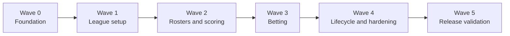

# GitHub Delivery Backlog

This backlog turns the system design into bounded issues suitable for one autonomous agent and one pull request. The design remains authoritative; issue text narrows scope but does not replace domain rules.

## Board conventions

Use a GitHub Project with these statuses: `Ready`, `In progress`, `In review`, `Blocked`, and `Done`.

Recommended labels:

- Area: `area:foundation`, `area:identity`, `area:league`, `area:roster`, `area:scoring`, `area:betting`, `area:frontend`, `area:operations`
- Work: `type:feature`, `type:infrastructure`, `type:test`, `type:documentation`
- Priority: `priority:p0`, `priority:p1`, `priority:p2`
- Coordination: `agent-ready`, `blocked`

An issue is `agent-ready` only when every dependency is closed. Do not assign two agents to issues that change the same domain transaction or migration chain at the same time.

## Delivery waves

Within a wave, issues without a dependency edge can run in parallel.

## Issue catalog

| ID | Issue title | Depends on | Size | Priority |
| --- | --- | --- | --- | --- |
| F-01 | `[Foundation] Scaffold the modular monolith and CI` | — | M | P0 |
| F-02 | `[Database] Create the private application schema and initial migration` | F-01 | L | P0 |
| F-03 | `[Backend] Add transaction, error, audit, and league-scope primitives` | F-02 | M | P0 |
| F-04 | `[Identity] Verify Supabase JWTs and resolve the current account` | F-02 | M | P0 |
| F-05 | `[Bootstrap] Provision the system owner and initial league idempotently` | F-03, F-04 | M | P0 |
| F-06 | `[Frontend] Build authentication, generated API client, and protected app shell` | F-04 | L | P0 |
| F-07 | `[Testing] Add isolated PostgreSQL integration-test infrastructure` | F-02 | M | P0 |
| L-01 | `[League] Create, list, and select current or historical leagues` | F-03, F-04 | M | P0 |
| L-02 | `[Membership] Manage members, player state, and commissioner authority` | L-01, F-07 | L | P0 |
| L-03 | `[Invitations] Invite new users and add existing accounts to a league` | L-02 | M | P0 |
| L-04 | `[Notifications] Deliver and retry existing-user league notifications` | L-03 | M | P1 |
| L-05 | `[Season setup] Manage buckets and castaway profiles` | L-01 | L | P0 |
| R-01 | `[Rosters] Save a complete league-scoped roster atomically` | L-02, L-05 | L | P0 |
| R-02 | `[Rosters] Build the player roster-selection experience` | R-01, F-06 | M | P0 |
| R-03 | `[Rosters] Add audited commissioner roster overrides` | R-01 | M | P0 |
| R-04 | `[Rosters] Lock rosters and enforce roster visibility` | R-01, R-03 | L | P0 |
| R-05 | `[Membership] Activate late players after commissioner roster entry` | R-03, R-04 | M | P1 |
| L-06 | `[Season setup] Apply destructive bucket and castaway mutations safely` | L-05, R-01 | L | P0 |
| S-01 | `[Scoring] Manage scoring actions with half-point precision` | F-03, L-05 | M | P0 |
| S-02 | `[Scoring] Record, edit, soft-delete, and restore scoring events` | S-01 | L | P0 |
| S-03 | `[Scoring] Cascade action deletion and restoration by deletion batch` | S-02 | M | P0 |
| S-04 | `[Standings] Calculate roster scores and final tie-break ranks in one query path` | R-01, S-02 | L | P0 |
| S-05 | `[Frontend] Build standings and the player-visible scoring ledger` | S-04, F-06 | L | P0 |
| B-01 | `[Betting] Configure betting and create the initial wager set` | L-02, L-05, F-03 | L | P1 |
| B-02 | `[Betting] Replace complete wager allocations under concurrent caps` | B-01, F-07 | XL | P1 |
| B-03 | `[Frontend] Build private wager allocation and projection UI` | B-02, F-06 | L | P1 |
| B-04 | `[Betting] Lock and unlock wagering with eligibility closure` | B-02 | L | P1 |
| B-05 | `[Betting] Reset wagers into an immutable historical set` | B-04 | XL | P1 |
| B-06 | `[Membership] Integrate late-player eligibility with current and reset wager sets` | R-05, B-01, B-05 | M | P1 |
| B-07 | `[Standings] Add private projected and public locked betting contributions` | S-04, B-04 | L | P1 |
| B-08 | `[Frontend] Build commissioner wagering status and wager-history views` | B-04, B-05, F-06 | M | P1 |
| O-01 | `[Lifecycle] Record placements and complete or reopen a league` | L-05, R-04, B-04 | L | P1 |
| O-02 | `[Audit] Build commissioner audit history and restore entry points` | F-03, L-06, S-03, B-05 | L | P1 |
| O-03 | `[Reliability] Add structured logging, stable errors, rate limits, and outage UX` | F-03, F-06 | L | P1 |
| O-04 | `[Deployment] Finalize the Railway image, migrations, health gates, and runbook` | F-05, O-03 | M | P1 |
| V-01 | `[Validation] Add cross-league authorization and visibility security suites` | L-02, R-04, B-07 | L | P0 |
| V-02 | `[Validation] Add database concurrency tests for wagering lifecycle commands` | B-02, B-04, B-05 | L | P0 |
| V-03 | `[Validation] Add responsive, accessibility, and critical-flow browser tests` | S-05, B-03, B-08, O-01 | L | P1 |
| V-04 | `[Validation] Verify standings performance and 50-member capacity` | S-04, B-07 | M | P1 |
| V-05 | `[Release] Run production-readiness review and first deployment` | O-04, V-01, V-02, V-03, V-04 | M | P0 |

## Issue specifications

### F-01 — Scaffold the modular monolith and CI

Outcome: a fresh clone can install, test, build, and package one FastAPI service containing the React assets.

Acceptance criteria:

- [ ] Python and Node versions, dependency locks, linting, type checking, tests, and CI are configured.
- [ ] `/health/live` works without a database and `/health/ready` probes PostgreSQL.
- [ ] Vite proxies local API traffic and the production image serves the built SPA.
- [ ] Unknown `/api/v1/*` routes return JSON `404`; only non-API GET routes may fall back to the SPA.
- [ ] `README.md` and `AGENTS.md` document local setup and the one-issue/one-PR agent workflow.

Tests: backend health tests, frontend smoke test, production frontend build, and container build.

Design references: Proposed Architecture; Interfaces; Deployment; Implementation Notes.

### F-02 — Create the private application schema and initial migration

Outcome: PostgreSQL contains every entity, enum, foreign key, check, partial unique index, and ordinary index named in the design.

Acceptance criteria:

- [ ] Tables are created outside exposed `public`/Data API schemas with explicit least-privilege grants.
- [ ] Soft-delete-aware uniqueness and current-wager-set uniqueness are database enforced.
- [ ] Scoring values use `NUMERIC(6,1)` and enforce half-point increments.
- [ ] Cross-entity league ownership is constrained wherever PostgreSQL can enforce it.
- [ ] Migration upgrade and downgrade are tested from an empty database.

Tests: schema introspection plus positive and negative constraint tests.

Design references: Data Model; Security and Privacy; Implementation Notes.

### F-03 — Add transaction, error, audit, and league-scope primitives

Outcome: every domain module has one consistent way to authorize, transact, audit, and return stable failures.

Acceptance criteria:

- [ ] Request and transaction correlation IDs are available to services and audit writers.
- [ ] Domain errors map to stable JSON codes and appropriate HTTP status codes.
- [ ] Repository helpers require a league identifier for league-owned records.
- [ ] Audit writes share the domain mutation transaction and support entity and correlation lookups.
- [ ] Stale destructive edits have an explicit version/conflict mechanism.

Tests: rollback behavior, cross-league negative cases, error-envelope contract, and audit atomicity.

Design references: Component Boundaries; Interfaces; Security and Privacy.

### F-04 — Verify Supabase JWTs and resolve the current account

Outcome: FastAPI securely maps a valid Supabase access token to an active local account.

Acceptance criteria:

- [ ] JWKS verification pins accepted algorithms and validates signature, issuer, audience, expiration, and subject.
- [ ] Missing, invalid, and unknown-account tokens return `401` with `WWW-Authenticate: Bearer`.
- [ ] Verified email refreshes the normalized local projection; user metadata never grants authorization.
- [ ] Soft-deleted accounts are denied even while their token remains valid.
- [ ] `/api/v1/session` returns only the current account and authorized league summaries.

Tests: key rotation/cache path, bad claims, missing local account, deleted account, and normalized email update.

Design references: Authentication, invitations, and database hosting; Security and Privacy.

### F-05 — Provision the system owner and initial league idempotently

Outcome: an operator command establishes or recovers the global owner and initial commissioner without duplicates.

Acceptance criteria:

- [ ] Parameters cover Supabase user ID, normalized email, display name, league name, and season name.
- [ ] The script calls the same application services used by HTTP routes.
- [ ] Re-running after full or partial success produces the same identities, league, membership, and role.
- [ ] Conflicting parameters fail clearly and leave state unchanged.

Tests: first run, repeated run, partial pre-existing state, and conflict rollback.

Design references: Bootstrap the system owner; Implementation Notes.

### F-06 — Build authentication, generated API client, and protected app shell

Outcome: invited users can establish a Supabase session and navigate a responsive protected shell without leaking private cache state.

Acceptance criteria:

- [ ] One Supabase browser client initializes and subscribes to auth changes exactly once.
- [ ] Protected routes wait for auth initialization and preserve a validated intended destination.
- [ ] API middleware reads the latest token per request; a bounded `401` path signs out and clears private queries.
- [ ] OpenAPI TypeScript generation is deterministic and CI fails on schema drift.
- [ ] The shell has accessible navigation plus loading, unavailable, unauthorized, and no-league states.

Tests: auth bootstrap, token refresh, redirect, sign-out cache clearing, `401`, and generated-client drift.

Design references: Frontend boundary; Interfaces; Security and Privacy.

### F-07 — Add isolated PostgreSQL integration-test infrastructure

Outcome: domain tests run against real PostgreSQL with deterministic data isolation and concurrency support.

Acceptance criteria:

- [ ] CI starts a supported PostgreSQL version and applies migrations before tests.
- [ ] Fixtures create accounts, multiple leagues, memberships, buckets, castaways, and time-controlled records.
- [ ] Parallel transaction tests use separate connections and deterministic barriers rather than sleeps.
- [ ] Tests leave no shared state and emit useful database diagnostics on failure.

Tests: fixture smoke tests and one demonstrated two-transaction serialization test.

Design references: Implementation Notes; Reliability.

### L-01 — Create, list, and select current or historical leagues

Outcome: only the system owner creates active leagues, while members can navigate their active and completed seasons.

Acceptance criteria:

- [ ] League creation is owner-only and one league directly represents one season.
- [ ] Members see only leagues with active memberships; completed leagues are read-only history.
- [ ] League selection is encoded in routes and every response is league scoped.
- [ ] Empty and unauthorized states are explicit.

Tests: owner/non-owner creation, membership filtering, completed history, and cross-league denial.

Design references: Configure a league; League State.

### L-02 — Manage members, player state, and commissioner authority

Outcome: commissioners can manage memberships and peer commissioners without violating participation or recovery rules.

Acceptance criteria:

- [ ] `is_commissioner` is independent of `pending_roster`, `active`, and `non_playing` participation.
- [ ] Add, remove, restore, promote, and demote commands are audited and league scoped.
- [ ] The final active commissioner cannot be removed, demoted, or deleted.
- [ ] The global owner has an audited commissioner-recovery operation.
- [ ] Only the global owner may soft-delete an account, after provider-session revocation succeeds.

Tests: role/state matrix, last-commissioner races, cross-league denial, and owner recovery.

Design references: Assumptions; Security and Privacy.

### L-03 — Invite new users and add existing accounts to a league

Outcome: commissioners can add either identity case without enabling public registration.

Acceptance criteria:

- [ ] Email matching is lowercase and trimmed throughout.
- [ ] New identities use the trusted Supabase admin invitation flow and accept only with the verified invited email.
- [ ] Existing accounts receive a membership immediately and enqueue a deduplicated application notification.
- [ ] Membership success is independent of notification provider success.
- [ ] Invitation and membership writes are rate limited and audited.

Tests: new/existing paths, duplicate email, invitation mismatch, notification failure, and cross-league denial.

Design references: Configure a league; Existing-user league notification; Security and Privacy.

### L-04 — Deliver and retry existing-user league notifications

Outcome: failed Resend messages are observable and safely retryable without duplicate logical dispatches.

Acceptance criteria:

- [ ] The provider adapter persists pending/sent/failed state, provider ID, error, and retry count.
- [ ] A stable deduplication key and provider idempotency key identify one logical message.
- [ ] Only commissioners of the league can inspect or retry a dispatch.
- [ ] Logs exclude message bodies and credentials.

Tests: success, permanent failure, transient failure, retry, and duplicate enqueue.

Design references: Existing-user league notification; Reliability.

### L-05 — Manage buckets and castaway profiles

Outcome: commissioners can configure the season roster while players receive a read-only active view.

Acceptance criteria:

- [ ] Bucket order/name and the full castaway profile are validated and league scoped.
- [ ] Active castaway names and placements are unique within a league.
- [ ] Every active castaway has exactly one active bucket before roster selection can open.
- [ ] Elimination status and explicit unique placement are editable independently of scoring eligibility.
- [ ] Image URLs render with a safe placeholder and are never fetched server-side.

Tests: CRUD, duplicate names/placements, unbucketed open rejection, and cross-league references.

Design references: Configure a league; Eliminate a castaway; Data Model.

### R-01 — Save a complete league-scoped roster atomically

Outcome: a player can replace their whole valid roster when self-service is open.

Acceptance criteria:

- [ ] One active castaway is required for every active bucket and selections may be shared across players.
- [ ] Incomplete, duplicate-bucket, deleted, wrong-bucket, and cross-league selections are rejected.
- [ ] A successful request replaces the full roster in one transaction.
- [ ] A player write is rejected while roster selection is locked.
- [ ] Existing state remains unchanged on every rejection.

Tests: complete replacement, all rejection modes, rollback, and concurrent lock/write behavior.

Design references: Select a roster; Data Model.

### R-02 — Build the player roster-selection experience

Outcome: players can confidently assemble and submit one complete pick per bucket on desktop or mobile.

Acceptance criteria:

- [ ] Picks are grouped by bucket with castaway context and a clear completeness summary.
- [ ] Draft state stays local until one complete allocation is submitted.
- [ ] Lock, invalidation, conflict, error, and saved states are accessible and actionable.
- [ ] Other players' rosters remain hidden until the server says they are visible.

Tests: keyboard selection, mobile layout, incomplete prevention, server rejection, and successful replacement.

Design references: Select a roster; Constraints.

### R-03 — Add audited commissioner roster overrides

Outcome: a commissioner can fill or replace another player's roster regardless of roster lock without unlocking the league.

Acceptance criteria:

- [ ] Override authorization is separate from player self-service authorization.
- [ ] Complete before/after selections, actor, target membership, timestamp, and optional reason are audited.
- [ ] The same completeness and league/bucket rules as self-service apply.
- [ ] The UI clearly identifies the target player and locked override behavior.

Tests: locked override, non-commissioner denial, invalid roster rollback, and audit payload.

Design references: Select a roster; Security and Privacy.

### R-04 — Lock rosters and enforce roster visibility

Outcome: commissioners can lock only after every active player has a complete roster; locking reveals rosters as designed.

Acceptance criteria:

- [ ] Lock validation reports every incomplete player and missing bucket without partial state change.
- [ ] Pending and non-playing members do not block the lock.
- [ ] Unlock and lock transitions are commissioner-only and audited.
- [ ] Player-to-player roster visibility is enforced server-side.

Tests: complete/incomplete cohorts, role denial, visibility before/after lock, and concurrent roster save.

Design references: Lock roster selection; Security and Privacy.

### R-05 — Activate late players after commissioner roster entry

Outcome: a newly added active-season player gains score access only after a commissioner saves a complete roster.

Acceptance criteria:

- [ ] Late players begin `pending_roster` and cannot see scores or standings.
- [ ] Saving a valid full roster and activation commit atomically.
- [ ] Score calculation includes the season's entire active event history, regardless of activation time.
- [ ] Existing active players and roster lock state are unchanged.

Tests: pending visibility, activation rollback, retroactive scoring, inactive member, and cross-league picks.

Design references: Add a player after the season starts.

### L-06 — Apply destructive bucket and castaway mutations safely

Outcome: commissioner-confirmed structure changes invalidate only the necessary picks and preserve scoring/wager history.

Acceptance criteria:

- [ ] Impact previews identify affected buckets, castaway, and players before confirmation.
- [ ] Moving a castaway clears selections in all affected buckets and unlocks rosters atomically.
- [ ] Castaway deletion clears its active picks and unlocks rosters but retains visible scoring events and existing wagers.
- [ ] Restore makes the castaway selectable again without restoring picks or reviving lost wagers.
- [ ] Incomplete active rosters remain ranked with missing buckets worth zero.

Tests: transactional rollback, exact affected-pick set, restore semantics, ledger retention, and wager loss permanence.

Design references: Change bucket membership; Soft-delete and restore a castaway.

### S-01 — Manage scoring actions with half-point precision

Outcome: commissioners can define positive or negative action values and understand retroactive impact.

Acceptance criteria:

- [ ] Values use Python `Decimal`, PostgreSQL `NUMERIC(6,1)`, and reject non-half increments.
- [ ] Names are unique among active actions in a league.
- [ ] Editing points previews affected event count and immediately changes derived scores.
- [ ] Completed leagues reject mutation.

Tests: precision boundaries, negative values, duplicate names, retroactive values, and cross-league denial.

Design references: Correct scoring; Implementation Notes.

### S-02 — Record, edit, soft-delete, and restore scoring events

Outcome: commissioners can maintain an auditable occurrence ledger that immediately drives scores.

Acceptance criteria:

- [ ] Each event has one active action, one active castaway, episode, and optional note from the same league.
- [ ] Roster and wager locks do not restrict event entry; league completion does.
- [ ] Eliminated castaways accept late/corrective events; soft-deleted castaways do not accept new events.
- [ ] Individual delete/restore preserves actor and timestamp history.
- [ ] Manual refresh returns current ledger values.

Tests: state matrix, league boundaries, elimination vs deletion, edit/delete/restore, and audit.

Design references: Record a scoring event; Correct scoring.

### S-03 — Cascade action deletion and restoration by deletion batch

Outcome: deleting an action removes its active events, while restoration revives only events deleted by that operation.

Acceptance criteria:

- [ ] Action and event soft deletion occur atomically with one `deletion_batch_id` and audit correlation ID.
- [ ] Events individually deleted before the cascade are not tagged or restored.
- [ ] Restoring an action revives only its matching cascade batch.
- [ ] Ledgers and standings reflect both transitions immediately.

Tests: mixed individually/cascade-deleted events, repeated cycles, rollback, and score recalculation.

Design references: Delete and restore a scoring action.

### S-04 — Calculate roster scores and final tie-break ranks in one query path

Outcome: standings are derived on demand without N+1 queries or mutable cached totals.

Acceptance criteria:

- [ ] Active event totals use current action values and include late-player history.
- [ ] Missing roster buckets contribute zero and surface missing bucket IDs.
- [ ] Midseason equal totals remain tied.
- [ ] When all placements exist, tied cohorts use summed pairwise bucket wins with `N + 1` for missing/unplaced picks and no secondary rule.
- [ ] The data fetch is a bounded database round-trip suitable for 50 members.

Tests: table-driven two/multi-player ties, shared castaways, missing buckets, equal bucket wins, and midseason-to-final transition.

Design references: Standings Tie-Breaking; Performance.

### S-05 — Build standings and the player-visible scoring ledger

Outcome: league players can inspect rank, completeness, score provenance, and current data after a manual refresh.

Acceptance criteria:

- [ ] Standings distinguish ties and incomplete rosters without inventing an ordering.
- [ ] Ledger supports bounded pagination/filtering and preserves events belonging to deleted castaways.
- [ ] Pending-roster members cannot access either screen.
- [ ] Refresh, empty, loading, and provider-unavailable states are usable on mobile and desktop.

Tests: visibility matrix, rank rendering, deleted-castaway history, pagination, keyboard, and responsive layouts.

Design references: Goals; Interfaces; Performance.

### B-01 — Configure betting and create the initial wager set

Outcome: a commissioner can enable optional betting once, creating sequence 1 and materialized eligible participations atomically.

Acceptance criteria:

- [ ] Initial budget, uniform castaway cap, and late-entry budget are non-negative whole numbers.
- [ ] Enabling locks configuration, creates exactly one current set, and admits every active player with the initial budget.
- [ ] Positive budgets start unsubmitted; zero budgets are complete without wager rows.
- [ ] Total eligible capacity is validated before opening.
- [ ] Repeated or concurrent enable commands cannot create two current sets.

Tests: eligibility matrix, zero budget, insufficient capacity, repeat/concurrent enable, and rollback.

Design references: Configure a league; Data Model.

### B-02 — Replace complete wager allocations under concurrent caps

Outcome: an eligible player can atomically replace their entire allocation without overspending a castaway cap.

Acceptance criteria:

- [ ] The current set and participation lock before state validation.
- [ ] The union of prior/proposed castaways locks in stable UUID order.
- [ ] Validation excludes the player's prior allocation, requires the exact budget, and rejects negative, decimal, eliminated, deleted, or cross-league targets.
- [ ] Cap conflicts name the castaway but never reveal exact remaining capacity.
- [ ] A rejected request preserves the previous complete allocation or unsubmitted state.
- [ ] A commissioner may make only an audited first submission for an unsubmitted player.

Tests: replacement/rollback, two-castaway reallocation, concurrent cap race, lock race, secrecy-safe errors, and proxy constraints.

Design references: Place and reallocate wagers; Transactional aggregate wager enforcement.

### B-03 — Build private wager allocation and projection UI

Outcome: a player can allocate the full budget and see only their own unlocked wager data and projected contribution.

Acceptance criteria:

- [ ] The editor requires exact whole-budget allocation and never persists drafts.
- [ ] Active eligible castaways are selectable with clear per-entry validation.
- [ ] Unlocked state shows only the requester's allocation/projection and no exact global capacity.
- [ ] Cap, stale-lock, and eligibility failures are recoverable without losing the local draft.
- [ ] The interface works by keyboard and at phone widths.

Tests: budget math, privacy response rendering, rejected submission recovery, keyboard flow, and responsive behavior.

Design references: Place and reallocate wagers; Security and Privacy.

### B-04 — Lock and unlock wagering with eligibility closure

Outcome: commissioners can reveal a valid current wager set and later reopen editing without admitting late members to that same set.

Acceptance criteria:

- [ ] Config and current set lock in the documented order before validation.
- [ ] First lock populates `eligibility_closed_at` exactly once.
- [ ] Lock refuses and reports positive-budget unsubmitted or invalid participations and capacity shortfall.
- [ ] Zero-budget participations do not block locking.
- [ ] Unlock preserves the eligibility cutoff and does not reveal private allocations while open.

Tests: lifecycle serialization, validation report, zero budget, late activation race, visibility, and repeated lock/unlock.

Design references: Lock wagering; Security and Privacy.

### B-05 — Reset wagers into an immutable historical set

Outcome: a commissioner can finalize a locked set and open the next blank set with correct carry-forward budgets.

Acceptance criteria:

- [ ] Config and current set lock before revalidation; unlocked sets reject reset.
- [ ] Finalization, surviving-stake budgets, late-entry budgets, new participations, and current-set replacement commit atomically.
- [ ] Eliminated/deleted stakes are visible as lost history and never carry forward.
- [ ] No castaway choices copy to the new set; zero carry-forward is automatically complete.
- [ ] Finalized sets and wagers are immutable and never contribute again to standings.

Tests: repeated resets, carry-forward matrix, late entry, zero budget, concurrent reset/lock/enable, uniqueness conflict, and rollback.

Design references: Reset wagers; League State.

### B-06 — Integrate late-player eligibility with current and reset wager sets

Outcome: activation deterministically materializes eligibility relative to the first-lock cutoff.

Acceptance criteria:

- [ ] Activation locks betting config then current set before deciding participation creation.
- [ ] Activation before first lock admits the player with initial budget.
- [ ] Activation after cutoff remains excluded through later unlocks.
- [ ] The next reset admits previously excluded active players using late-entry budget.
- [ ] The `BETTING_PARTICIPATION` row is the sole authoritative set admission predicate.

Tests: activation/lock race, pre/post cutoff, unlock, reset admission, and deleted/non-playing membership.

Design references: Add a player after the season starts; Assumptions.

### B-07 — Add private projected and public locked betting contributions

Outcome: standings include betting at the correct visibility and payout stage without counting historical sets twice.

Acceptance criteria:

- [ ] While unlocked, shared standings rank by scoring events only; the requester receives their projection separately.
- [ ] Projection is the largest possible payout among current wagers on active castaways.
- [ ] Once placement 1 exists, contribution is twice the current-set stake on that winner.
- [ ] Locked wagering reveals each player's contribution and wager-adjusted standings.
- [ ] Historical finalized sets never add to the contribution.

Tests: privacy matrix including commissioners, active/eliminated/deleted targets, winner finalization, and reset non-duplication.

Design references: Assumptions; Interfaces; Security and Privacy.

### B-08 — Build commissioner wagering status and wager-history views

Outcome: commissioners can operate the wager lifecycle without seeing competitors' unlocked choices.

Acceptance criteria:

- [ ] Open-set administration shows eligibility, submitted/complete/invalid status, and capacity sufficiency only.
- [ ] It does not expose another player's castaway choices, amounts, projections, or exact cap usage.
- [ ] Lock, unlock, and reset actions include impact confirmation and actionable validation failures.
- [ ] Locked and finalized sets provide paginated read-only history to league players.

Tests: commissioner/player visibility, lifecycle controls, proxy-submission disclosure, and history pagination.

Design references: Place and reallocate wagers; Lock wagering; Reset wagers.

### O-01 — Record placements and complete or reopen a league

Outcome: commissioners can archive a valid season and reopen it for controlled corrections.

Acceptance criteria:

- [ ] Completion lists all missing/duplicate placements and enforces exactly one placement 1.
- [ ] Roster selection must be locked and current wagering must be locked when enabled.
- [ ] Completed leagues reject all mutations but remain normally visible as history.
- [ ] Reopen preserves roster and wager lock values.
- [ ] Complete/reopen transitions are audited.

Tests: every completion precondition, read-only enforcement, reopened corrections, preserved locks, and concurrency.

Design references: Complete and reopen a league; League State.

### O-02 — Build commissioner audit history and restore entry points

Outcome: commissioners can trace sensitive changes by entity/correlation and invoke only valid restorations.

Acceptance criteria:

- [ ] Audit history is commissioner-only, bounded, paginated, and filterable by entity and correlation.
- [ ] Before/after details render safely without leaking secrets or hidden unlocked wagers to unauthorized viewers.
- [ ] Supported deleted entities expose state-aware restore actions.
- [ ] Multi-record operations appear as one correlated narrative.

Tests: access control, pagination, correlation grouping, restore state, and sensitive-field redaction.

Design references: Goals; Data Model; Security and Privacy.

### O-03 — Add structured logging, stable errors, rate limits, and outage UX

Outcome: expected provider and domain failures are diagnosable without leaking credentials or crashing the service.

Acceptance criteria:

- [ ] Structured logs contain request ID, route/status, local account ID, league ID, domain code, provider ID, and migration version where applicable.
- [ ] Tokens, email bodies, credentials, and full audit payloads are excluded.
- [ ] Database-dependent routes return `503 database_unavailable` while the process and SPA remain available.
- [ ] Invitation, authentication-adjacent, and mutation endpoints use documented single-process limits.
- [ ] Frontend shows a clean paused/unavailable recovery state.

Tests: log capture/redaction, provider failures, database outage, rate limits, and UI recovery.

Design references: Reliability; Observability; Security and Privacy.

### O-04 — Finalize the Railway image, migrations, health gates, and runbook

Outcome: one production artifact deploys safely to Railway and connects to Supabase PostgreSQL using the chosen persistent connection mode.

Acceptance criteria:

- [ ] Multi-stage image builds hashed React assets and runs one FastAPI process on Railway's `PORT`.
- [ ] Pre-deploy migrations and `/health/ready` gate rollout; `/health/live` remains process-only.
- [ ] Runtime and migration database URLs, TLS, pool sizing, origin allowlist, and server/browser secrets are separated.
- [ ] Runbook covers paused Supabase recovery, notification retry, rollback limits, manual pre-migration backup, and owner recovery.
- [ ] Cost alerts/limits and first-week/month reviews are documented.

Tests: container smoke test, deep-link SPA fallback, JSON API 404, missing-secret failure, and migration failure behavior.

Design references: Deployment Architecture; Deployment; Failure Modes.

### V-01 — Add cross-league authorization and visibility security suites

Outcome: high-risk tenant and privacy rules have systematic negative coverage.

Acceptance criteria:

- [ ] Every league-scoped API group is exercised with a valid ID belonging to another league.
- [ ] Owner, commissioner, player, pending, non-playing, removed, and deleted-account roles are table driven.
- [ ] Unlocked roster and wager data remain private at API payload level, not merely in UI.
- [ ] Unknown opaque IDs do not leak resource existence through inconsistent responses.

Tests: the security suite itself is the deliverable and runs in CI.

Design references: Security and Privacy; Risks.

### V-02 — Add database concurrency tests for wagering lifecycle commands

Outcome: the documented lock order and invariants are proven under real concurrent transactions.

Acceptance criteria:

- [ ] Competing submissions cannot exceed a castaway cap.
- [ ] Reallocation across two castaways cannot deadlock under the stable lock order.
- [ ] Submission cannot commit after a concurrent lock.
- [ ] Activation cannot cross the first-lock cutoff.
- [ ] Concurrent reset/lock/unlock/enable commands leave one valid current set.

Tests: deterministic PostgreSQL concurrency tests with bounded timeouts and failure diagnostics.

Design references: Transactional aggregate wager enforcement; Design Review Findings.

### V-03 — Add responsive, accessibility, and critical-flow browser tests

Outcome: the core player and commissioner journeys work across supported browsers and representative mobile layouts.

Acceptance criteria:

- [ ] Chromium runs on every pull request; Firefox, WebKit, mobile, and axe checks run on the agreed CI cadence.
- [ ] Critical flows cover invitation sign-in, league setup, roster, scoring correction, wager submit/lock/reset, standings, and completion.
- [ ] Tests assert behavior at boundary widths, keyboard focus, zoom/reflow, and reduced motion.
- [ ] Fixtures never require production providers or secrets.

Tests: Playwright projects and accessibility scans are the deliverable.

Design references: Constraints; Deployment; frontend testing recommendations.

### V-04 — Verify standings performance and 50-member capacity

Outcome: the on-demand aggregation choice is measured against the initial target before caching is considered.

Acceptance criteria:

- [ ] A realistic fixture covers 50 members, full rosters, season events, and betting history.
- [ ] Query count proves no member-by-member access pattern.
- [ ] `EXPLAIN (ANALYZE, BUFFERS)` output is reviewed and missing indexes are addressed.
- [ ] Measured local/test-environment latency and limitations are documented without claiming unsupported scale.

Tests: repeatable data generator and benchmark check with a non-flaky budget.

Design references: Performance; Risks.

### V-05 — Run production-readiness review and first deployment

Outcome: the first release is deployed with verified security, recovery, cost, and end-to-end behavior.

Acceptance criteria:

- [ ] All P0/P1 issues are closed and the final migration set is reviewed.
- [ ] Supabase public signup is disabled, custom SMTP is configured, private schema exposure is verified, and secrets are correctly separated.
- [ ] Railway deployment passes readiness and a production smoke test with invited test accounts.
- [ ] Backup/rollback, paused-project recovery, notification retry, and owner recovery are rehearsed.
- [ ] Cost monitoring is enabled and known first-release risks are recorded.

Tests: production smoke checklist and captured release notes.

Design references: Operational Considerations; Security and Privacy; Risks.

